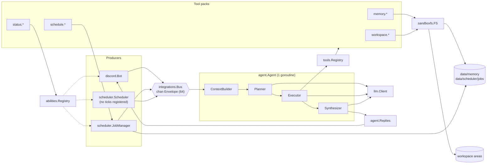

# Design

The container-level deployment diagram is in the [README](../README.md#system-design). This file covers what happens inside the `tobee` process.

## Architecture

One Go process with three concerns:

- **Integrations** produce inbound `Envelope`s and deliver outbound text.
- **The agent loop** is a single serial consumer. It runs one envelope to completion before taking the next.
- **Tools and storage** are what the loop uses during a turn. Everything the model can read, write, or do goes through the tool registry.



### Components

| Component | Package | Responsibility |
|---|---|---|
| `Integration` | `internal/integrations` | `Name`, `Start`, `Stop`. Lifecycle is managed in `main.go`. |
| `Envelope` | `internal/integrations` | Normalized inbound event: integration, user, user name, channel, thread, message ID, content, received time. |
| `Bus` | `internal/integrations` | Buffered channel (64). `Publish` never blocks; if the buffer is full the envelope is dropped with a warning. |
| Discord bot | `internal/integrations/discord` | Gateway listener, addressed-message filter, mention rewriting, 2000-character splitting, send / edit / react, `discord` Reporter. |
| `JobManager` | `internal/scheduler` | Model-created jobs: robfig cron for recurring jobs, `time.AfterFunc` for one-shots, one JSON file per job, `schedules` Reporter. |
| `Scheduler` | `internal/scheduler` | Publishes a fixed envelope on an interval. Nothing is registered today; `scheduler` Reporter. |
| `Agent` | `internal/agent/loop.go` | Serial worker. Runs `processTurn`: plan → announce → execute → synthesize → deliver. |
| `ContextBuilder` | `internal/agent/context.go` | Builds the single system message for a request. |
| `Conversation` / `Turn` | `internal/agent` | Growing message list shared by all phases; per-envelope state (plan-message ID, reactions, verbatim blocks, reply). |
| `Planner` | `internal/agent/planner.go` | One LLM call that must call `plan.commit`. Produces either steps or a `direct_reply`. |
| `Executor` | `internal/agent/executor.go` | ReAct loop for each step. All registered tools plus `step.finish`. |
| `Synthesizer` | `internal/agent/synthesizer.go` | One LLM call that must call `reply.commit`. `renderReply` assembles the final text. |
| `StateTemplates` | `internal/agent/state.go` | Loads `prompts/state/*.md` (`text/template`) and wraps each rendering in `<phase name="…">`. |
| `Replies` | `internal/agent/reply.go` | Lookup table from integration name to `ReplySender`, optional `MessageEditor`, and optional `Reactor`. |
| `llm.Client` | `internal/llm` | Non-streaming `POST /v1/chat/completions`; `tools`, `tool_choice`, temperature, `max_tokens`. |
| `tools.Registry` | `internal/tools` | JSON-Schema specs, a per-tool timeout (30s default), panic recovery, the `Verbatim` flag. |
| `abilities.Registry` | `internal/abilities` | Collects `Reporter.Render` output from each subsystem, sorted by name. |
| `sandboxfs.FS` | `internal/sandboxfs` | Filesystem rooted at one directory. Rejects paths that escape it. Per-instance file size cap. |
| `scope.UserScope` | `internal/scope` | Integration, user, user name, channel, and thread on `ctx`. `Dir()` returns `users/<integration>/<user>`, sanitized. |

### Wiring order (`cmd/tobee/main.go`)

1. Load `.env`. Read env vars (see the [README](../README.md#configuration--environment-variables)).
2. Create the LLM client (`MaxTokens` 2048, HTTP timeout 10m), the memory FS (`DATA_DIR/memory`, 64 KiB cap), and the workspace areas.
3. Create the tool registry. Register `memory.*` and `status.*`, plus `workspace.*` if any areas are configured.
4. Load the system prompt fragments and state templates. If any are missing, log `prompts: MISSING` at ERROR and keep running.
5. Create the planner, executor, synthesizer, bus, and agent (turn budget 2m).
6. Create the Discord bot, which registers its sender, editor, and reactor. Register the `discord` Reporter.
7. Create the scheduler and `JobManager` (`DATA_DIR/scheduler/jobs`). Register `schedule.*` and both scheduler Reporters.
8. Start Discord, then the agent loop, the scheduler, and `JobManager`, which replays saved jobs. Log `tobee is running`, which the CI smoke test waits for.

## Turn Lifecycle

### Conversation shape (one request)

```
0    system  prompts/system/*.md + <workspace_areas> + <context> + <memory>
1    user    the user's message, verbatim, untagged
2    user    <phase name="plan">…</phase>
3    asst    plan.commit({goal, steps, direct_reply})   tools=[plan.commit]            tool_choice=required
4    tool    ok
             ── if direct_reply and zero steps: deliver it and stop (1 LLM call) ──
5    user    <phase name="execute_step">…</phase>       (step 1 of N)
6    asst    <tool call>                                tools=registry + step.finish   tool_choice=required
7    tool    <result or "error: …">
…    asst    step.finish({result, finished})
…    tool    ok
             ── repeat per step; finished=true skips the remaining steps ──
N    user    <phase name="synthesize">…</phase>
N+1  asst    reply.commit({spoken, artifacts})          tools=[reply.commit]           tool_choice=required
N+2  tool    ok
```

### Phases

1. **Plan.** The user text and the plan directive are sent as separate messages. `plan.commit` takes a `goal`, `steps: [{intent}]` (zero or more), and an optional `direct_reply`.
   - If steps survive trimming, `direct_reply` is cleared.
   - Zero steps with no `direct_reply` is an error.
   - `plan.md` asks for at most six steps. This is prompt guidance only; code doesn't enforce it.
2. **Fast path (D-032).** If `direct_reply` is set, the loop delivers it and returns. No announcement, execution, or synthesis.
3. **Announce.** Sends `**Working on:** <goal>` plus a numbered checklist. The loop keeps the message ID and edits the message as step statuses change (⏳ 🔄 ✅ ❌ ⏭️). A failed send or edit is logged and the turn continues.
4. **Execute.** For each step: append the `execute_step` directive, then loop through LLM call → tool calls → tool results until `step.finish`.
   - A failed step doesn't stop the plan. The next step runs, and synthesis sees the failure.
   - `finished: true` marks the remaining steps skipped.
   - If the last step completes without `finished: true`, a WARN is logged.
5. **Synthesize.** Append the `synthesize` directive. When verbatim output exists, the template tells the model that output is already handled. `reply.commit` returns `spoken` and `artifacts`, and `renderReply` builds the text.
6. **Deliver.** Send `Turn.Reply`.
   - Non-empty reply: clear all progress reactions.
   - Empty reply: add ❌. This is the only place ❌ is applied.

### Progress feedback

| Signal | Where | Values |
|---|---|---|
| Reactions on the inbound message | Only envelopes with a `MessageID` (Discord). Scheduled fires get none. | ✅ received → 🧠 planning → 💭 executing. Cleared on success; ❌ on failure. |
| Plan message edits | Announced plans only | ⏳ pending, 🔄 running, ✅ done, ❌ failed, ⏭️ skipped |

### Budgets and limits

| Limit | Value | Source |
|---|---|---|
| Turn wall-clock budget | 2m | `agent.Config.TurnBudget` (hardcoded in `main.go`) |
| Executor LLM calls per step | 4 | `PLAN_MAX_STEPS_PER_STEP` |
| Executor LLM calls per turn | 12 | `PLAN_MAX_STEPS_TOTAL`. Counted before each call, so failed calls count. |
| LLM HTTP timeout / max tokens | 10m / 2048 | `main.go` (the turn context cancels first) |
| Temperature | 0.1 | `AI_TEMPERATURE` (`llm.DefaultTemperature`) |
| Tool call timeout | 30s | `tools.Spec.Timeout` default |
| Bus buffer | 64 envelopes | `integrations.NewBus(64)` |
| Memory / workspace file size cap | 64 KiB / 256 KiB | `main.go` / `WORKSPACE_MAX_FILE_SIZE` |
| Status window | default 1h, max 30d | `internal/tools/status` |
| Discord message length | 2000 chars | `discord/split.go` |

## Reasoning Patterns

| Pattern | Where it appears |
|---|---|
| **Plan-and-Execute** (Plan-and-Solve) | The planner commits a structured plan before any tool runs. No replanning: failed steps are reported, not revised. |
| **ReAct** (Reason + Act) | Inside each step: tool call → tool result → repeat until `step.finish`. |
| **Self-declared completion** | `step.finish({finished: true})` ends the plan early, like Cline's `attempt_completion`. |
| **Direct-answer fast path** | `direct_reply` in `plan.commit`. The route is decided inside the planning call, not by a separate classifier. |
| **Final synthesis** | A separate call that presents results instead of continuing the conversation. |
| **Structured output via forced tool calls** | Every phase uses `tool_choice=required` with a virtual tool whose schema defines the output. |
| **Corrective retry ("re-asking")** | A protocol violation adds a `PROTOCOL VIOLATION: …` nudge and retries once. |
| **Tool errors returned to the model** | A tool error becomes the tool result (`error: …`) and the model decides what to do next. |
| **Content/presentation separation** | The model provides `spoken` and `artifacts`; Go writes the code fences. |
| **Return-direct passthrough** | Output from `Verbatim` tools is appended by code and never rewritten by the model. Same idea as LangChain's `return_direct`. |
| **Spotlighting** (delimiting) | Harness directives are wrapped in `<phase>` tags; user text never is. |
| **Tool-driven memory recall** | Nothing from memory is pre-loaded into the prompt; the model calls `memory.*` to fetch it. |

### Retry and failure handling

| Phase | Retry budget | Unrecoverable | Result of exhaustion |
|---|---|---|---|
| Planner | 2 attempts shared by LLM errors and violations. The nudge is added only after the first violation. | Bad `plan.commit` JSON; zero steps and no `direct_reply` | Turn aborts before the announcement; ❌ |
| Executor (per step) | 1 retry for LLM errors plus 1 retry for violations, both within the per-step and total budgets | Bad `step.finish` JSON; turn context expired | Step marked ❌; the plan continues |
| Synthesizer | 2 attempts shared, like the planner | Bad `reply.commit` JSON | If verbatim blocks exist, send them alone; otherwise an empty reply and ❌ |
| Tool call | No automatic retry | Unknown tool, timeout, panic (recovered) | Sent to the model as `error: …` |
| Announce, edit, react, send | No retry | — | Logged; turn continues |

Violations are logged at ERROR with the prefix `PROTOCOL VIOLATION` and fields `attempt`, `expected_tool`, `finish`, `text_chars`, `text_preview`, `tool_calls`.

### Output formatting (`renderReply`)

1. Trimmed `spoken` text.
2. Each non-empty artifact as ```` ```<lang>\n<body>\n``` ````.
3. Each verbatim block: single-line output is appended as plain text; multi-line output is wrapped in a bare code fence. Blocks with identical text appear once per turn.
4. Discord: outbound `@displayname` becomes `<@id>`, then the text is split at ≤2000 characters. Preferred break points in order: after a closing fence, a paragraph break, a sentence end, a newline, then a hard cut.

## Prompt Architecture

- **System message** (built once per request, `ContextBuilder.ComposeSystem`), in order:
  1. `prompts/system/*.md`, sorted by filename and joined: identity, tone, behaviour, output, safety, tools catalogue.
  2. `<workspace_areas>`: name, read-only flag, description. Never host paths. Omitted when no areas exist.
  3. `<context>`: `now` (RFC3339 plus a readable date), integration, channel, thread, user name and ID.
  4. `<memory>`: fixed hint naming the `memory.*` tools. Adds a shared-scope-only note when no user is attached.
- **Phase directives** are user-role messages rendered from `prompts/state/{plan,execute_step,synthesize}.md` with `StateData` (`Plan`, `Step`, `StepNumber`, `StepTotal`, `AvailableTools`, `HasVerbatim`).
- **What each file owns.** `prompts/system/` holds rules true in every phase. State templates hold one phase's contract. Phase rules placed in the system prompt leak into other phases.
- **Tools catalogue.** `05-tools.md` is written by hand. The `tools=[…]` API parameter is what actually limits which tools can be called (D-028).
- **Prefix caching.**
  - Across turns, sections 1–2 are identical.
  - `<context>` changes every turn (clock, user, channel).
  - Within a turn, message 0 never changes and the list only grows, so each call only processes the new tail.

## Memory Model

### Taxonomy (loosely CoALA)

| Kind | Lives at | Written by |
|---|---|---|
| Working | The current turn's `Conversation`; never saved | The loop |
| Semantic | `user.md`, `facts/*.md` under a scope | `memory.write` / `memory.append` |
| Procedural | `preferences.md`, `feedback/*.md` under a scope | `memory.write` / `memory.append` |

No episodic tier: there are no sessions or summaries (D-027).

### Layout

```
data/
├─ memory/
│  ├─ shared/                        # scope="shared"
│  └─ users/<integration>/<userId>/  # scope="user"; IDs sanitized to [A-Za-z0-9_-]
└─ scheduler/
   └─ jobs/<id>.json                 # one file per job; ids are "j-<8 hex>"
```

- The prompts (`02-behaviour.md`, `05-tools.md`) direct this structure within each scope: `INDEX.md`, `user.md`, `preferences.md`, `facts/<topic>.md`, `feedback/<date>-<slug>.md`.
- Filenames actually written are rewritten by `datedname.Apply` to `<dir>/YYYY.MM.DD-<kebab-name><ext>`. See [IMPLEMENTATION.md](IMPLEMENTATION.md#known-limitations).

### Tools

| Tool | Args | Default scope | Notes |
|---|---|---|---|
| `memory.read` | `path`, `scope` | `user` | |
| `memory.write` | `path`, `content`, `scope` | `user` | Filename date-stamped; overwrites |
| `memory.append` | `path`, `content`, `scope` | `user` | Filename date-stamped; creates if missing |
| `memory.search` | `query`, `limit` (20), `scope` | `both` | Case-insensitive substring; `<scope>:<path>:<line>  <snippet>` |
| `memory.list` | `dir`, `scope` | `both` | `<scope>:<path>` |

- `scope="user"` on a turn with no user attached (e.g. a static tick) returns an error telling the model to use `shared`.
- `both` covers `shared` plus the current user's tree only. Other users' trees are never searched or listed.

### Safety

- **Path sandbox** (`sandboxfs.resolve`) rejects empty, absolute, volume-qualified, and `..` paths, then re-checks the result with `filepath.Rel`. All memory and workspace operations use it.
- **Size caps** are enforced on `Write` and on the combined size after `Append`.
- **No approval gate.** The model writes what it judges useful.
- **Memory is data, not instructions.** This is prompt guidance only (`04-safety.md`). No code-level framing is applied to tool results.
- **Curating `INDEX.md`** is expected to be a human task. Nothing enforces this.

## Other Subsystems

- **Discord intake** (`onMessageCreate`):
  - Drops bot, self, and out-of-channel messages.
  - Accepts a message only if it's addressed: bot mention, raw `<@id>` or `<@!id>`, a reply to the bot, or `\btobee\b` (case-insensitive).
  - Rewrites inbound `<@id>` to `@name` using a cache of names it has seen.
  - Sets `IsDirect` for DMs. `Thread` is never set.
- **Scheduled jobs:**
  - `schedule.create` requires the turn scope to have an integration and a channel. Takes `at` (RFC3339 or `in <duration>`) or `cron` (5-field or `@every` / `@hourly` / …, no seconds).
  - A fired job publishes an envelope with the original integration, channel, thread, user, and user name. The content is `[scheduled fire: <name>] <prompt>`.
  - One-shots are deleted after firing. At boot, one-shots whose time has passed are deleted without running (misfire policy: skip).
- **Status:**
  - `status.report` renders `tobee status — window <since> → <now>`, then a `## <reporter>` section for each reporter (`discord`, `scheduler`, `schedules`) with Doing / Done / Waiting lines, or `(idle)`.
  - `status.summary` joins each reporter's non-empty sentence, or returns `Everything quiet.`
  - Both are `Verbatim`.
- **Workspace areas:**
  - Defined as `WORKSPACE_AREA_<NAME>` (root), `_DESC`, `_READONLY` (`1` / `true` / `yes` / `y` / `on`). The name is lowercased.
  - `workspace.search` defaults to `area="all"`. `workspace.write` rejects read-only areas and date-stamps filenames.
  - Env entries without a root are reported as a warning at boot.

## Key Decisions

Decisions currently in force. IDs are cited in code comments; don't renumber. Superseded entries are listed in [IMPLEMENTATION.md](IMPLEMENTATION.md#superseded-decisions).

| ID | Decision | Why | Cost / constraint |
|---|---|---|---|
| D-001 | Native OpenAI tool calling; never JSON embedded in text. | The earlier JSON-in-text protocol needed retry loops for fences, `<think>` leaks, and drift. | The model and server must support function calling. |
| D-002, D-018 | Packages under `internal/`; binary at `cmd/tobee`; module `github.com/runyanjake/tobee`. | Idiomatic Go layout. | — |
| D-003 | Memory is sandboxed under `data/memory` through `sandboxfs`. | The agent writes without approval, so damage must be bounded. | No arbitrary host-file access except through workspace areas. |
| D-004 | No vector search, reflection cron, or MCP. | Corpus is small; no signal yet. | Each can be added later without reshaping existing code. |
| D-005 | Single serial agent worker. | No races on memory writes; replies stay in order. | One turn blocks all others for up to 2m. |
| D-007 | No `!command` prefix control plane. | It turned into a second control plane. | Poking tools requires Go tests or a live LLM. |
| D-008 | `data/` is fully gitignored; no seed files. | Memory is private to each install. | Fresh installs start empty. |
| D-009 | Replies go through the `Replies` table, not a `send.*` tool. | Replying is the default end of a turn, not a model choice. | Messaging another channel would need a new tool. |
| D-012, D-028 | System prompt = `prompts/system/*.md` sorted by numeric prefix; tools catalogue is the static `05-tools.md`. | Fragments are easy to edit; one hand-written catalogue shared by every phase. | New tools must be added to `05-tools.md` by hand. |
| D-013 | Memory split into `shared/` and `users/<integration>/<id>/`; scope travels on `ctx`. | Per-user isolation without a user table. | Search and list must never cross user trees. |
| D-014, D-021 | Subsystems expose `Reporter.Render → (full, summary)` text; status tools compose it. | Consistent wording; no reach-in coupling. | Reporters format their own text. |
| D-015 | Model-created jobs: one JSON file each, robfig cron plus `AfterFunc`, replayed at boot, misfire skip. | Reminders must survive restart and route back to the originating channel. | Missed one-shots are dropped silently. |
| D-017 | Stable sections first in the system message. | Prefix caching on the LLM server. | Reordering sections must keep the stable-first order. |
| D-019 | Workspace areas: operator-configured sandboxed roots; list injected into the system prompt. | Access limited to directories the operator opts in; no discovery calls needed. | Area names and descriptions are visible to the model. |
| D-024 | Tool-using turns run plan → announce → execute → synthesize. | A typed plan drives execution, progress UI, and synthesis input. | At least 3 LLM calls for tool turns. |
| D-025 | Strict tool-call protocol in every phase; one nudge-and-retry; no text fallbacks. | Every text escape hatch became a class of "the model decided" bugs. | Worst case doubles the calls for a phase. |
| D-026 | Memory is never pre-loaded into the prompt; recall is a tool call. | Bounded prompt; auditable reads; no stale snapshots. | Recall costs 1–2 extra tool calls. |
| D-027 | Each message is a standalone turn: no ring buffer, summarizer, or sessions. | Transcripts got polluted; summaries were hallucinated; sessions mixed users in shared channels. | "Make it spicy" has no referent unless it was saved to memory. |
| D-029 | One `Conversation` per request; phase directives from `prompts/state/` in `<phase>` tags; every step gets every tool. | Planner and executor share context; one system message enables prefix caching. | Synthesis sees the full transcript (continuation risk). |
| D-030 | Verbatim is a registry property enforced in code; clock stamped in `<context>`; status takes a relative `window`. | "Relay verbatim" in prose was ignored; the model invented windows and state. | Only a short lead-in is written by the model on status turns. |
| D-032 | Planner may commit `direct_reply` with zero steps. | A greeting used to cost 3 LLM calls and render a checklist. | A wrong route produces a wrong answer, and nothing in code prevents it. |

## Rejected Alternatives

| Alternative | Why rejected | Ref |
|---|---|---|
| JSON embedded in text instead of tool calls | Brittle parsing and a retry-loop tax | D-001 |
| Separate triage/classifier call before planning | `tool_choice=required` didn't hold on the local model; adds a round trip | D-022 → D-023, D-030, D-032 |
| Pure ReAct loop with always-on synthesis | Synthesis continued the conversation instead of presenting results; no plan to announce | D-023 → D-024, D-029 |
| Planner with `plan.revise` replanning | Removed when the plan/execute shape was restored; failures are reported instead | D-020 → D-024 |
| Per-step tool scoping | The planner granted empty tool lists, so steps did nothing | D-029 |
| Text-wrap fallback / salvage parser for tool calls written as text | Masks an undiagnosed cause; reintroduces "the model chooses the format" | D-025, `3e818f9` |
| Session ring buffer, rolling summarizer, idle rotation, janitor | Polluted transcripts, hallucinated summaries, users mixed in shared channels | D-027 |
| Pre-loading `INDEX.md` / profile / preferences into the prompt | Unbounded prompt growth, stale snapshots | D-026 |
| Pre-loading only when under a size cap | "Sometimes in context, sometimes not" is unpredictable | D-026 |
| Asking the model to relay status verbatim | The model reworded it and invented facts | D-030 |
| Skip synthesis entirely on verbatim turns | Loses tobee's voice on casual questions | D-030 |
| Discord embeds for structured output | The reply path is plain strings through every integration | D-030 |
| `send.*` reply tool | Makes delivery optional and confusing | D-009 |
| Sidecar container for cleanup | Overkill; the janitor itself was later removed | D-010 → D-027 |
| `workspace.delete` / `move` / `exec` | Destructive or high-risk with no human in the loop | D-019 |
| More than one retry per phase, backoff | Only covers for a broken model | D-025 |
| CI check that `05-tools.md` matches the registry | Harness cost; revisit if drift causes bugs | D-028 |
| `direct_reply` length cap | No evidence of overuse | D-032 |

## Open Questions

- **Why the model writes tool calls as text.** See [GOALS.md](GOALS.md#current-operational-priorities).
- **Synthesizer context.** Full transcript (current) or `[system, user, directive]` (branch `synth-slim-context-violations`)?
- **Streaming replies** vs. single-shot delivery.
- **Provider abstraction:** only needed when a second backend is actually in flight.
- **`INDEX.md` curation:** keep it human-maintained or let the agent own it.
