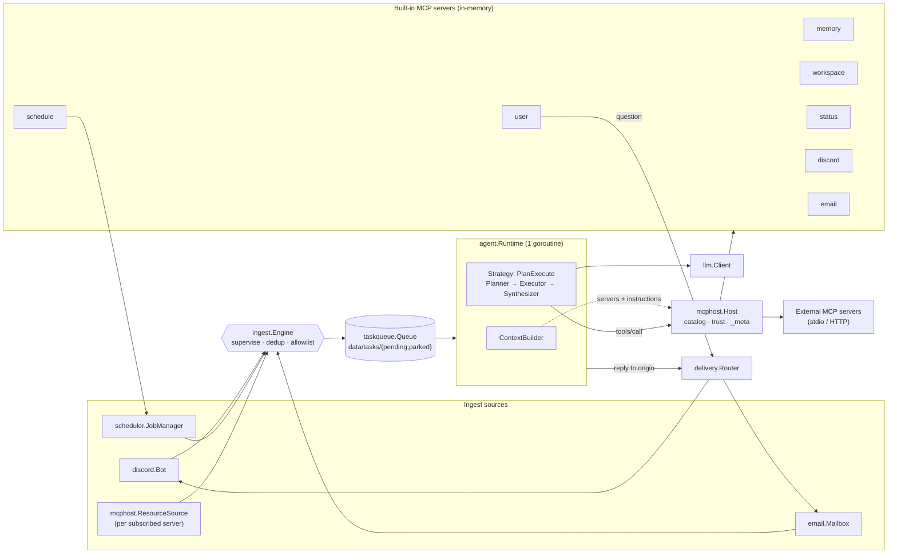

# Design

The container-level deployment diagram is in the [README](../README.md#system-design). This file covers what happens inside the `tobee` process.

## Architecture

One Go process, organized as an input side, a core, and an output side:

- **Ingest.** Sources (Discord, email, scheduled jobs, MCP resource subscriptions) emit `event.Event`s. The ingest engine supervises the sources, drops duplicates and senders that aren't allowed, and writes each event to a durable task queue (D-034).
- **Core.** A single serial runtime takes one task at a time and hands it to a reasoning `Strategy` (D-005, D-037). The runtime handles scope, the turn budget, delivery, and parking.
- **Tools.** Everything the model can do goes through the MCP host. Built-in capabilities are in-process MCP servers. External servers connect over stdio or Streamable HTTP. The model sees one catalog of `<server>_<tool>` names (D-033).
- **Delivery.** The reply to the event's origin is sent by code through the delivery router. Messages anywhere else are tool calls (D-035).

A **connector** is one package that plays all three roles for an external system. For example, `connectors/discord` is an ingest source, a delivery channel, and an MCP server.


```mermaid
flowchart LR
    subgraph sources["Ingest sources"]
        discordSrc["discord.Bot"]
        emailSrc["email.Mailbox"]
        jobs["scheduler.JobManager"]
        resSrc["mcphost.ResourceSource<br/>(per subscribed server)"]
    end
    engine{{"ingest.Engine<br/>supervise · dedup · allowlist"}}
    queue[("taskqueue.Queue<br/>data/tasks/{pending,parked}")]
    subgraph core["agent.Runtime (1 goroutine)"]
        ctxb["ContextBuilder"]
        strat["Strategy: PlanExecute<br/>Planner → Executor → Synthesizer"]
    end
    llm["llm.Client"]
    host["mcphost.Host<br/>catalog · trust · _meta"]
    subgraph builtin["Built-in MCP servers (in-memory)"]
        mem["memory"]
        ws["workspace"]
        sch["schedule"]
        st["status"]
        usr["user"]
        dsrv["discord"]
        esrv["email"]
    end
    ext["External MCP servers<br/>(stdio / HTTP)"]
    out["delivery.Router"]

    discordSrc & emailSrc & jobs & resSrc --> engine --> queue --> core
    ctxb -.->|servers + instructions| host
    strat --> llm
    strat -->|tools/call| host
    host --> builtin
    host --> ext
    sch --> jobs
    usr -->|question| out
    core -->|reply to origin| out
    out --> discordSrc & emailSrc
```

### Components

| Component | Package | Responsibility |
|---|---|---|
| `Event`, `Address` | `internal/event` | Normalized inbound event: ID (dedup key), source, kind (`message` / `timer` / `notification`), actor, origin address, message ID, in-reply-to, content. `ResumeKeys` builds the keys that match parked tasks. |
| `ingest.Engine` | `internal/ingest` | `Register` / `Unregister` sources at any time. Supervises each `Source.Run` and restarts it with backoff (1s doubling to 1m; reset after 1m of health). Dedups on `(source, ID)` over the last 1024 events. Applies per-source actor allowlists. `ingest` Reporter. |
| `taskqueue.Queue` | `internal/taskqueue` | Durable FIFO. One JSON file per pending task; capacity 256. A task is removed only on `Done` or `Park` (at-least-once). A task dequeued 2 times without finishing is dropped at boot. Also holds parked tasks (24h TTL). `tasks` Reporter. |
| `agent.Runtime` | `internal/agent/runtime.go` | Serial worker. For each task: attach scope, build the system message, run the strategy, then deliver the reply or park the task. |
| `Strategy` / `PlanExecute` | `internal/agent` | A reasoning scheme: fills `Turn.Reply` or `Turn.Await`. `PlanExecute` is the only implementation (D-037). |
| `ContextBuilder` | `internal/agent/context.go` | Builds the system message: prompt fragments, `<servers>`, `<context>`. |
| `Planner` / `Executor` / `Synthesizer` | `internal/agent` | The phases of `PlanExecute`. Virtual tools `plan_commit`, `step_finish`, `reply_commit`. |
| `mcphost.Host` | `internal/mcphost` | One MCP client session per server. Aggregates `tools/list` into the catalog and refreshes on `notifications/tools/list_changed`. Routes calls with a per-call timeout (30s default) and caps results at 32 KiB. Enforces trust (D-038). `mcp` Reporter. |
| `mcphost.LoadServers` | `internal/mcphost/config.go` | Parses `MCP_SERVER_<NAME>_*` into external server configs and builds their transports. |
| `mcphost.ResourceSource` | `internal/mcphost` | Ingest source over `resources/subscribe`. Each update is read and emitted as a `notification` event. |
| `mcpserver.Server` | `internal/mcpserver` | Builder for built-in servers. Re-attaches scope from `_meta`, turns handler errors into error results, recovers panics, and carries tobee metadata (`tobee/verbatim`, `tobee/await`). |
| Built-in servers | `internal/servers/{memory,workspace,schedule,status,user}` | `memory_*`, `workspace_*`, `schedule_*`, `status_*`, `user_ask`. |
| Discord connector | `internal/connectors/discord` | Gateway source (addressed-message filter, mention rewriting), `Send` / `Edit` / `React` channel with 2000-character splitting, `discord_send_message`, `discord` Reporter. |
| Email connector | `internal/connectors/email` | IMAP poller source (allowlisted senders, unseen only, ≤20 per poll, quoted history stripped), SMTP channel with `In-Reply-To` threading, `email_send`, `email` Reporter. |
| `JobManager` | `internal/scheduler` | Model-created jobs as an ingest source: robfig cron for recurring, `time.AfterFunc` for one-shots, one JSON file per job, `schedules` Reporter. |
| `delivery.Router` | `internal/delivery` | Connector name → `Channel`; optional `Editor` and `Reactor` interfaces. |
| `llm.Client` | `internal/llm` | Non-streaming `POST /v1/chat/completions` with `tools`, `tool_choice`, temperature, `max_tokens`, optional bearer key. |
| `abilities.Registry` | `internal/abilities` | Collects `Reporter.Render` output from each subsystem, sorted by name. |
| `sandboxfs.FS` | `internal/sandboxfs` | Filesystem rooted at one directory. Rejects paths that escape it. Per-instance file size cap. |
| `telemetry` | `internal/telemetry` | Log categories, a context-carried logger for correlation attributes, content truncation, and the handler that tags untagged records `cat=system` (D-040). |
| `scope.UserScope` | `internal/scope` | Connector, user, user name, channel, and thread. Travels on `ctx` in the runtime and as `_meta["tobee/scope"]` to trusted servers. `Dir()` returns `users/<connector>/<user>`, sanitized. |

### Wiring order (`cmd/tobee/main.go`)

1. Load `.env`. Read env vars (see the [README](../README.md#configuration--environment-variables)).
2. Create the LLM client, the memory FS (`DATA_DIR/memory`, 64 KiB cap), and the workspace areas.
3. Create the abilities registry, delivery router, task queue (`DATA_DIR/tasks`), ingest engine, and MCP host.
4. For each configured connector (Discord if `DISCORD_TOKEN`; email if `EMAIL_IMAP_ADDR`), register its delivery channel, ingest source, allowlist, MCP server, and Reporter. Exit if there are none.
5. Create `JobManager` (`DATA_DIR/scheduler/jobs`) and register it as a source.
6. Connect the built-in servers `memory`, `status`, `schedule`, `user`, and `workspace` (only if areas are configured). Each one's instructions come from `prompts/servers/<name>.md`.
7. Connect external servers from `MCP_SERVER_*`. A failure is logged and skipped. Register a `ResourceSource` for each server with subscriptions.
8. Load the system prompt fragments and state templates. If any are missing, log `prompts: MISSING` at ERROR and keep running.
9. Build the strategy named by `AGENT_STRATEGY` and the runtime.
10. Start the engine and the runtime. Log `tobee is running`. A source that fails to start is retried in the background; CI also waits for `discord: connected`.

## Ingest and Tasks

### Event flow

1. A source calls `emit(event)`.
2. The engine fills in `Source`, `ID`, and `Received` if they are missing. It drops duplicates, then drops events whose actor is not on that source's allowlist. Events with no actor, such as timers, skip the allowlist.
3. `Queue.Enqueue` checks the event's resume keys against parked tasks. If one matches, the new task carries a `Resume`.
4. The task is written to `data/tasks/pending/<nanos>-<id>.json` and the runtime is signalled.
5. The runtime dequeues the task, increments `Attempts` on disk, and runs the turn. Then it calls `Done`, which deletes the file, or `Park`.

### Sources

| Source | Kind | Actor | Origin | Admission |
|---|---|---|---|---|
| `discord` | `message` | author ID / display name | `discord:<channel>` | Addressed messages only (below). `DISCORD_CHANNEL_ID` and `DISCORD_ALLOWED_USERS` narrow further. |
| `email` | `message` | sender address | `email:<sender>`, thread = Message-ID | `EMAIL_ALLOWED` (required). Unlisted mail is never fetched past the envelope and stays unread. |
| `schedule` | `timer` | the job creator | the creating channel | Always |
| `mcp_<server>` | `notification` | none | `_REPLY_TO` | Server must be `_TRUSTED` |

- **Discord addressing:**
  - Drops messages from bots, from itself, and from outside the configured channel.
  - Accepts a message only if it's addressed: a bot mention, a raw `<@id>` or `<@!id>`, a reply to the bot, or `\btobee\b` (case-insensitive).
  - Rewrites inbound `<@id>` to `@name`.
  - A reply to one of the bot's messages sets `InReplyTo`.
- **Email:**
  - Takes the first `text/plain` part; HTML-only mail is skipped.
  - Cuts the body at an `On … wrote:` line or `-----Original Message-----`, and drops `>` lines.
  - Content is `Subject: <subject>\n\n<body>`.
  - Marks fetched mail `\Seen`. If that fails, dedup absorbs the repeat on the next poll.

### Parked tasks (D-036)

- `user_ask` sends the question to the turn's origin and returns `_meta["tobee/await"] = {question, keys}`. The keys are `reply:<connector>:<channel>:<questionMsgID>` and `actor:<connector>:<channel>:<userID>`.
- The executor ends the step and the turn, and the runtime calls `Queue.Park`. The parked record holds the original request, the question, the keys, and the time asked. It never holds a transcript or plan.
- A later `message` event from a person matches reply keys first, then actor keys; the most recent question wins. Expired records (over 24h) are deleted when found.
- The resumed turn opens with `user: <request>`, `assistant: <question>`, `user: <answer>`, then plans from scratch.
- On Discord the answer must still be addressed, and replying to the question is the natural way. On email any reply from the same sender matches.

## Tools (MCP)

### Catalog

- Tool names are `<server>_<tool>`, sanitized to `[A-Za-z0-9_-]` and capped at 64 characters. This matches the function-name pattern hosted APIs enforce. A name that collides is skipped with a warning.
- Every step's LLM call advertises the whole catalog plus `step_finish` (D-029).
- `ContextBuilder` renders `<servers>`: one `## <name>` section per server, with its instructions and tool names. External servers are marked `(external)` and get no instructions.

### Built-in servers

| Server | Tools | Notes |
|---|---|---|
| `memory` | `read`, `write`, `append`, `search`, `list` | See [Memory Model](#memory-model). |
| `workspace` | `areas`, `list`, `read`, `write`, `search` | Only when areas exist. Area names, flags, and descriptions are appended to the instructions (never host paths). |
| `schedule` | `create`, `cancel`, `list` | `create` needs a connector and channel in scope. |
| `status` | `summary`, `report` | Verbatim. Reporters: `discord`, `email`, `ingest`, `mcp`, `schedules`, `tasks`. |
| `user` | `ask` | Parks the task (D-036). Needs a user in scope. |
| `discord` | `send_message` | Any channel ID. Not for replying to the current conversation. |
| `email` | `send` | Allowlisted recipients only, enforced in code. |

### Trust (D-038)

| | Trusted (built-in, or `_TRUSTED=true`) | Untrusted (external default) |
|---|---|---|
| `_meta["tobee/scope"]` sent on calls | yes | no |
| Instructions in the system prompt | yes | no (name and tools only) |
| `tobee/verbatim`, `tobee/await` honored | yes | no |
| May feed tasks via `_SUBSCRIBE` | yes | no (config rejected) |

- A stdio server's process gets only `PATH`, `HOME`, and its `_ENV_*` values.
- Tool output from any server is capped at 32 KiB. Non-text content blocks are named, not dropped.

## Turn Lifecycle (`PlanExecute`)

### Conversation shape (one request)

```
0    system  prompts/system/*.md + <servers> + <context>
1    user    the user's message, verbatim, untagged     (resumed: request, assistant question, answer)
2    user    <phase name="plan">…</phase>
3    asst    plan_commit({goal, steps, direct_reply})   tools=[plan_commit]            tool_choice=required
4    tool    ok
             ── if direct_reply and zero steps: deliver it and stop (1 LLM call) ──
5    user    <phase name="execute_step">…</phase>       (step 1 of N)
6    asst    <tool call>                                tools=catalog + step_finish    tool_choice=required
7    tool    <result or "error: …">
…    asst    step_finish({result, finished})
…    tool    ok
             ── repeat per step; finished=true skips the remaining steps; user_ask parks ──
N    user    <phase name="synthesize">…</phase>
N+1  asst    reply_commit({spoken, artifacts})          tools=[reply_commit]           tool_choice=required
N+2  tool    ok
```

### Phases

1. **Plan.** The request messages and the plan directive are sent as separate messages. `plan_commit` takes a `goal`, `steps: [{intent}]` (zero or more), and an optional `direct_reply`.
   - If steps survive trimming, `direct_reply` is cleared.
   - Zero steps with no `direct_reply` is an error.
   - `plan.md` asks for at most six steps, and for a single clarifying step when the request is too ambiguous to act on. This is prompt guidance only.
2. **Fast path (D-032).** If `direct_reply` is set, the strategy returns it. No announcement, execution, or synthesis.
3. **Announce.** Only if the origin connector supports edits (Discord, not email). Sends `**Working on:** <goal>` plus a numbered checklist. The message is edited as step statuses change (⏳ 🔄 ✅ ❌ ⏭️). A failed send or edit is logged and the turn continues.
4. **Execute.** For each step: append the `execute_step` directive, then loop through LLM call → tool calls → tool results until `step_finish`.
   - A failed step doesn't stop the plan. The next step runs, and synthesis sees the failure.
   - `finished: true` marks the remaining steps skipped.
   - A tool result carrying `tobee/await` ends the step and the turn. Calls the model batched after it get a `skipped` tool result, and synthesis is skipped.
   - If the last step completes without `finished: true`, a WARN is logged.
5. **Synthesize.** Append the `synthesize` directive. When verbatim output exists, the template tells the model that output is already handled. `reply_commit` returns `spoken` and `artifacts`, and `renderReply` builds the text.
6. **Deliver (runtime).** Send `Turn.Reply` to the origin.
   - Non-empty reply: clear all progress reactions.
   - Empty reply: add ❌. This is the only place ❌ is applied.
   - Parked turn: clear reactions; the question is the output.

### Progress feedback

| Signal | Where | Values |
|---|---|---|
| Reactions on the inbound message | Events with a `MessageID` on a connector that supports reactions (Discord) | ✅ received → 🧠 planning → 💭 executing. Cleared on success or park; ❌ on failure. |
| Plan message edits | Announced plans only (connectors with edit support) | ⏳ pending, 🔄 running, ✅ done, ❌ failed, ⏭️ skipped |

### Budgets and limits

| Limit | Value | Source |
|---|---|---|
| Turn wall-clock budget | 2m | `AGENT_TURN_BUDGET` |
| Executor LLM calls per step | 4 | `PLAN_MAX_STEPS_PER_STEP` |
| Executor LLM calls per turn | 12 | `PLAN_MAX_STEPS_TOTAL`. Counted before each call, so failed calls count. |
| LLM HTTP timeout / max tokens | 10m / 2048 | `AI_TIMEOUT` / `AI_MAX_TOKENS` (the turn context cancels first) |
| Temperature | 0.1 | `AI_TEMPERATURE` (`llm.DefaultTemperature`) |
| Tool call timeout | 30s | `MCP_SERVER_<NAME>_TIMEOUT`; built-ins use the default |
| Tool result size | 32 KiB | `mcphost.maxResultBytes` |
| Task queue capacity | 256 pending | `main.go` |
| Task attempts | 2 | `taskqueue.maxAttempts` |
| Parked task TTL | 24h | `taskqueue.ParkTTL` |
| Dedup window | 1024 events | `ingest.dedupSize` |
| Source restart backoff | 1s → 1m | `ingest` |
| Email per poll / body | 20 messages / 16 KiB | `connectors/email` |
| Memory / workspace file size cap | 64 KiB / 256 KiB | `main.go` / `WORKSPACE_MAX_FILE_SIZE` |
| Status window | default 1h, max 30d | `internal/servers/status` |
| Discord message length | 2000 chars | `discord/split.go` |

## Reasoning Patterns

| Pattern | Where it appears |
|---|---|
| **Plan-and-Execute** (Plan-and-Solve) | The planner commits a structured plan before any tool runs. No replanning: failed steps are reported, not revised. |
| **ReAct** (Reason + Act) | Inside each step: tool call → tool result → repeat until `step_finish`. |
| **Self-declared completion** | `step_finish({finished: true})` ends the plan early, like Cline's `attempt_completion`. |
| **Direct-answer fast path** | `direct_reply` in `plan_commit`. The route is decided inside the planning call, not by a separate classifier. |
| **Human-in-the-loop clarification** | `user_ask` suspends the task and resumes on the answer, like LangGraph's `interrupt`, with state limited to request + question. |
| **Final synthesis** | A separate call that presents results instead of continuing the conversation. |
| **Structured output via forced tool calls** | Every phase uses `tool_choice=required` with a virtual tool whose schema defines the output. |
| **Corrective retry ("re-asking")** | A protocol violation adds a `PROTOCOL VIOLATION: …` nudge and retries once. |
| **Tool errors returned to the model** | A tool error becomes the tool result (`error: …`) and the model decides what to do next. |
| **Content/presentation separation** | The model provides `spoken` and `artifacts`; Go writes the code fences. |
| **Return-direct passthrough** | Output from verbatim tools is appended by code and never rewritten by the model. Same idea as LangChain's `return_direct`. |
| **Spotlighting** (delimiting) | Harness directives are wrapped in `<phase>` tags; user text never is. |
| **Tool-driven memory recall** | Nothing from memory is pre-loaded into the prompt; the model calls `memory_*` to fetch it. |

### Retry and failure handling

| Phase | Retry budget | Unrecoverable | Result of exhaustion |
|---|---|---|---|
| Planner | 2 attempts shared by LLM errors and violations. The nudge is added only after the first violation. | Bad `plan_commit` JSON; zero steps and no `direct_reply` | Turn aborts before the announcement; ❌ |
| Executor (per step) | 1 retry for LLM errors plus 1 retry for violations, both within the per-step and total budgets | Bad `step_finish` JSON; turn context expired | Step marked ❌; the plan continues |
| Synthesizer | 2 attempts shared, like the planner | Bad `reply_commit` JSON | If verbatim blocks exist, send them alone; otherwise an empty reply and ❌ |
| Tool call | No automatic retry | Unknown tool, timeout, transport failure, panic (recovered in built-ins) | Sent to the model as `error: …` |
| Source | Restart with backoff, forever | — | Logged; `ingest` Reporter shows `down` |
| Task | Redelivered after a crash, up to 2 attempts | — | Dropped at boot with an ERROR |
| Announce, edit, react, send | No retry | — | Logged; turn continues |

Violations are logged at ERROR as `agent: PROTOCOL VIOLATION` (`cat=llm`) with fields `phase`, `attempt`, `expected_tool`, `finish`, `text_chars`, `text_preview`, `tool_calls`.

## Logging (D-040)

Every record has a `cat` attribute. Records from a turn also carry `task`, and within a phase `phase` (`plan` / `execute` / `synthesize`) and `step`. The attributes ride on a logger in the context (`telemetry.With`).

| `cat` | Level | Record (`msg`) | Content |
|---|---|---|---|
| `input` | INFO | `agent: input` | Event source, kind, connector, channel, user, `content`; on a resumed task also `resumes`, `request`, `question` |
| `thinking` | INFO | `agent: reasoning` | The model's separate reasoning (`reasoning_content` / `reasoning`), when the server returns it |
| `thinking` | INFO | `agent: model text` | Any text the model wrote alongside its tool call |
| `thinking` | INFO | `agent: plan` | `goal`, `route` (`steps` / `direct_reply`), `steps` |
| `thinking` | INFO | `agent: step begin` / `step result` / `step failed` | Intent; `result` and `finished`; error |
| `action` | INFO / WARN | `agent: tool call` / `tool result` | `tool`, `call_id`, `args`; `status` (`ok` / `verbatim` / `await` / `error` / `failed`), `duration_ms`, `content` |
| `output` | INFO | `agent: output` | `kind` (`reply` / `plan` / `question`), destination, `content` |
| `llm` | INFO | `agent: llm call` | `duration_ms`, `prompt_tokens`, `completion_tokens`, `finish`, `tool_calls` |
| `llm` | ERROR | `agent: llm call failed`, `agent: PROTOCOL VIOLATION` | Error or violation details |
| `llm` | DEBUG | `agent: llm message` / `llm response` | Each message added since the previous call, and the raw response, unabridged |
| `system` | any | everything else | Lifecycle, connectors, ingest, MCP host |

- A turn's INFO trail runs input → thinking / action → output, so it can be read without DEBUG. DEBUG adds the exact prompt, logged incrementally rather than re-printing the transcript on every call.
- `content`-style fields are cut at `LOG_CONTENT_LIMIT` bytes (default 4000; 0 = unlimited), with a `<field>_chars` companion holding the full length. DEBUG message logs are never cut.
- Reasoning is logged but never sent back to the model.
- `LOG_FORMAT=json` makes categories filterable with `jq`; in text, `grep cat=<category>`.

### Output formatting (`renderReply`)

1. Trimmed `spoken` text.
2. Each non-empty artifact as ```` ```<lang>\n<body>\n``` ````.
3. Each verbatim block: single-line output is appended as plain text; multi-line output is wrapped in a bare code fence. Blocks with identical text appear once per turn.
4. Connector rendering. Discord turns outbound `@displayname` into `<@id>`, then splits at ≤2000 characters. Preferred break points, in order: after a closing fence, a paragraph break, a sentence end, a newline, then a hard cut. Email sends the text as a plain-text body.

## Prompt Architecture

- **System message** (built once per request, `ContextBuilder.ComposeSystem`), in order:
  1. `prompts/system/*.md`, sorted by filename and joined: identity, tone, behaviour, output, safety, tools.
  2. `<servers>`: each connected server's name, trusted instructions, and tool names. Built-in instructions are `prompts/servers/<name>.md`. The workspace server appends its area list.
  3. `<context>`: `now` (RFC3339 plus a readable date), source, kind, connector, channel, thread, and user name and ID, or `user=none`.
- **Phase directives** are user-role messages rendered from `prompts/state/{plan,execute_step,synthesize}.md` with `StateData` (`Plan`, `Step`, `StepNumber`, `StepTotal`, `AvailableTools`, `HasVerbatim`).
- **What each file owns.**
  - `prompts/system/` holds rules true in every phase.
  - `prompts/servers/` holds how to use one server.
  - State templates hold one phase's contract.
  - Phase rules placed in the system prompt leak into other phases.
- **Prefix caching.**
  - Across turns, sections 1–2 are identical until a server connects, disconnects, or changes its tool list.
  - `<context>` changes every turn.
  - Within a turn, message 0 never changes and the list only grows.

## Memory Model

### Taxonomy (loosely CoALA)

| Kind | Lives at | Written by |
|---|---|---|
| Working | The current turn's `Conversation`; never saved | The strategy |
| Semantic | `user.md`, `facts/*.md` under a scope | `memory_write` / `memory_append` |
| Procedural | `preferences.md`, `feedback/*.md` under a scope | `memory_write` / `memory_append` |

No episodic tier: there are no sessions or summaries (D-027). Parked tasks keep only a request and a question, for up to 24h (D-036).

### Layout

```
data/
├─ memory/
│  ├─ shared/                        # scope="shared"
│  └─ users/<connector>/<userId>/    # scope="user"; IDs sanitized to [A-Za-z0-9_-]
├─ scheduler/
│  └─ jobs/<id>.json                 # one file per job; ids are "j-<8 hex>"
└─ tasks/
   ├─ pending/<nanos>-<id>.json      # queued and in-flight tasks; ids are "t-<8 hex>"
   └─ parked/<id>.json               # questions waiting on an answer
```

- The prompts (`02-behaviour.md`, `servers/memory.md`) direct this structure within each scope: `INDEX.md`, `user.md`, `preferences.md`, `facts/<topic>.md`, `feedback/<date>-<slug>.md`.
- Filenames actually written are rewritten by `datedname.Apply` to `<dir>/YYYY.MM.DD-<kebab-name><ext>`. See [IMPLEMENTATION.md](IMPLEMENTATION.md#known-limitations).
- Email users get their own tree, keyed by address: `users/email/me_example_com/`. The same person on Discord is a different user.

### Tools

| Tool | Args | Default scope | Notes |
|---|---|---|---|
| `memory_read` | `path`, `scope` | `user` | |
| `memory_write` | `path`, `content`, `scope` | `user` | Filename date-stamped; overwrites |
| `memory_append` | `path`, `content`, `scope` | `user` | Filename date-stamped; creates if missing |
| `memory_search` | `query`, `limit` (20), `scope` | `both` | Case-insensitive substring; `<scope>:<path>:<line>  <snippet>` |
| `memory_list` | `dir`, `scope` | `both` | `<scope>:<path>` |

- `scope="user"` on a turn with no user attached (a resource notification) returns an error telling the model to use `shared`.
- `both` covers `shared` plus the current user's tree only. Other users' trees are never searched or listed.

### Safety

- **Path sandbox** (`sandboxfs.resolve`) rejects empty, absolute, volume-qualified, and `..` paths, then re-checks the result with `filepath.Rel`. All memory and workspace operations use it.
- **Size caps** are enforced on `Write` and on the combined size after `Append`.
- **No approval gate.** The model writes what it judges useful.
- **Tool results are data, not instructions.** This is prompt guidance only (`04-safety.md`). No code-level framing is applied to tool results.
- **Curating `INDEX.md`** is expected to be a human task. Nothing enforces this.

## Other Subsystems

- **Scheduled jobs:**
  - `schedule_create` requires the turn scope to have a connector and a channel. Takes `at` (RFC3339 or `in <duration>`) or `cron` (5-field or `@every` / `@hourly` / …, no seconds).
  - A fired job emits a `timer` event with the original connector, channel, thread, user, and user name. The content is `[scheduled fire: <name>] <prompt>`. The event ID is `<job>@<unix>`.
  - One-shots are deleted after firing. At boot, one-shots whose time has passed are deleted without running (misfire policy: skip).
  - A job that comes due while the source is stopped is skipped and left on disk for the misfire policy.
  - The job file keeps the JSON key `integration` for the connector name, so jobs saved before D-034 still load.
- **Status:**
  - `status_report` renders `tobee status — window <since> → <now>`, then a `## <reporter>` section for each reporter with Doing / Done / Waiting lines, or `(idle)`.
  - `status_summary` joins each reporter's non-empty sentence, or returns `Everything quiet.`
  - The `ingest`, `mcp`, `email`, and `tasks` reporters show lifetime counters; `window` only narrows `discord` and `schedules`.
- **Workspace areas:**
  - Defined as `WORKSPACE_AREA_<NAME>` (root), `_DESC`, `_READONLY` (`1` / `true` / `yes` / `y` / `on`). The name is lowercased.
  - `workspace_search` defaults to `area="all"`. `workspace_write` rejects read-only areas and date-stamps filenames.
  - Env entries without a root are reported as a warning at boot.

## Key Decisions

Decisions currently in force. IDs are cited in code comments; don't renumber. Superseded entries are listed in [IMPLEMENTATION.md](IMPLEMENTATION.md#superseded-decisions).

| ID | Decision | Why | Cost / constraint |
|---|---|---|---|
| D-001 | Native OpenAI tool calling; never JSON embedded in text. | The earlier JSON-in-text protocol needed retry loops for fences, `<think>` leaks, and drift. | The model and server must support function calling. |
| D-002, D-018 | Packages under `internal/`; binary at `cmd/tobee`; module `github.com/runyanjake/tobee`. | Idiomatic Go layout. | — |
| D-003 | Memory is sandboxed under `data/memory` through `sandboxfs`. | The agent writes without approval, so damage must be bounded. | No arbitrary host-file access except through workspace areas. |
| D-005 | Single serial agent worker, now draining the task queue. | No races on memory writes; replies stay in order. | One turn blocks all others for up to the turn budget. |
| D-007 | No `!command` prefix control plane. | It turned into a second control plane. | Poking tools requires Go tests or a live LLM. |
| D-008 | `data/` is fully gitignored; no seed files. | Memory is private to each install. | Fresh installs start empty. |
| D-012 | System prompt = `prompts/system/*.md` sorted by numeric prefix. | Fragments are easy to edit. | Order is a filename convention. |
| D-013 | Memory split into `shared/` and `users/<connector>/<id>/`; scope travels on `ctx` and in `_meta`. | Per-user isolation without a user table. | Search and list must never cross user trees; one person on two connectors is two users. |
| D-014, D-021 | Subsystems expose `Reporter.Render → (full, summary)` text; status tools compose it. | Consistent wording; no reach-in coupling. | Reporters format their own text. |
| D-015 | Model-created jobs: one JSON file each, robfig cron plus `AfterFunc`, replayed at boot, misfire skip. | Reminders must survive restart and route back to the originating channel. | Missed one-shots are dropped silently. |
| D-017 | Stable sections first in the system message. | Prefix caching on the LLM server. | Reordering sections must keep the stable-first order. |
| D-019 | Workspace areas: operator-configured sandboxed roots; list carried in the workspace server's instructions. | Access limited to directories the operator opts in; no discovery calls needed. | Area names and descriptions are visible to the model. |
| D-024 | Tool-using turns run plan → announce → execute → synthesize. | A typed plan drives execution, progress UI, and synthesis input. | At least 3 LLM calls for tool turns. |
| D-025 | Strict tool-call protocol in every phase; one nudge-and-retry; no text fallbacks. | Every text escape hatch became a class of "the model decided" bugs. | Worst case doubles the calls for a phase. |
| D-026 | Memory is never pre-loaded into the prompt; recall is a tool call. | Bounded prompt; auditable reads; no stale snapshots. | Recall costs 1–2 extra tool calls. |
| D-027 | No chat history: no ring buffer, summarizer, or sessions. The only cross-turn state is a parked question (D-036). | Transcripts got polluted; summaries were hallucinated; sessions mixed users in shared channels. | "Make it spicy" has no referent unless it was saved to memory. |
| D-029 | One `Conversation` per request; phase directives from `prompts/state/` in `<phase>` tags; every step gets every tool. | Planner and executor share context; one system message enables prefix caching. | Synthesis sees the full transcript (continuation risk). |
| D-030 | Verbatim output is enforced in code, now as `tobee/verbatim` tool metadata honored for trusted servers; clock stamped in `<context>`; status takes a relative `window`. | "Relay verbatim" in prose was ignored; the model invented windows and state. | Only a short lead-in is written by the model on status turns. |
| D-032 | Planner may commit `direct_reply` with zero steps. | A greeting used to cost 3 LLM calls and render a checklist. | A wrong route produces a wrong answer, and nothing in code prevents it. |
| D-033 | MCP is the only tool plane. Built-ins are in-process MCP servers; the host aggregates `tools/list` into one catalog named `<server>_<tool>`; server instructions (from `prompts/servers/`) replace the hand-written catalogue. Virtual tools are `plan_commit`, `step_finish`, `reply_commit`. | One path for built-in and third-party tools; the catalog can't drift from what's callable; names valid on every OpenAI-compatible backend. | In-process servers can't see the turn's `ctx`, so scope rides in `_meta`. Tool renames touched every prompt. |
| D-034 | Input is an ingest engine of `Source`s feeding a durable task queue. Sources register and unregister at runtime and restart with backoff; events are deduped and allowlisted per source; tasks are on disk until done, at most 2 attempts. | Any number of inputs (chat, mail, timers, MCP notifications) through one path; nothing lost on restart or while a long turn runs. | At-least-once: a crash mid-turn can repeat a reply. A bad token now retries instead of exiting. |
| D-035 | A connector is one package that is a source, a delivery channel, and an MCP server. The reply to the origin is sent in code; messages elsewhere (`discord_send_message`, `email_send`) and questions (`user_ask`) are tools. Plans are announced only where edits work. | The default reply can't be skipped or reworded; the model can still reach people deliberately. | Two ways to send text; prompts must say which is which. |
| D-036 | Clarifying questions park the task. `user_ask` sends the question and returns `tobee/await` keys; an answer matching a reply key (or, failing that, the same user in the same channel) within 24h resumes it as request → question → answer. | Blocking inside a 2-minute turn can't wait for a person; a full transcript would reintroduce session state. | The resumed turn replans from scratch. A user's unrelated next message in that channel can be taken as the answer. |
| D-037 | Reasoning schemes implement `Strategy`; `PlanExecute` is the only one; `AGENT_STRATEGY` selects it. | The operator wants to try other schemes without touching the runtime. | An interface with one implementation, by explicit choice. |
| D-038 | Trust is per MCP server. Built-ins are trusted; external servers are untrusted unless `_TRUSTED=true`: no scope in `_meta`, no instructions in the prompt, no verbatim/await, no subscriptions. Stdio servers get a minimal environment. Email is allowlisted inbound and outbound. | Third-party servers and inboxes are the widest prompt-injection surface; the system prompt is the most privileged place text can land. | Untrusted servers get less context and may be less useful. |
| D-039 | The LLM backend is configuration: `AI_PROVIDER_URL`, `AI_MODEL`, `AI_API_KEY`, `AI_TEMPERATURE`, `AI_MAX_TOKENS`, `AI_TIMEOUT`. The OpenAI-compatible chat API is the contract. | Switching models or hosts is planned; no code change should be needed. | Backends without an OpenAI-compatible endpoint need a proxy. |
| D-040 | Logs are categorized by the reasoning chain: `input`, `thinking`, `action`, `output`, plus `llm` and `system`, with `task` / `phase` / `step` correlation from a context logger. The INFO trail carries content (capped by `LOG_CONTENT_LIMIT`); DEBUG adds the exact prompts, logged incrementally. | One turn's input, reasoning, actions, and output must be reconstructable and filterable without DEBUG; the old DEBUG dump re-printed the whole transcript per call and dropped model reasoning. | User messages and tool output are in INFO logs; lower `LOG_CONTENT_LIMIT` to trim them. |

## Rejected Alternatives

| Alternative | Why rejected | Ref |
|---|---|---|
| JSON embedded in text instead of tool calls | Brittle parsing and a retry-loop tax | D-001 |
| Separate triage/classifier call before planning | `tool_choice=required` didn't hold on the local model; adds a round trip | D-022 → D-023, D-030, D-032 |
| Pure ReAct loop with always-on synthesis | Synthesis continued the conversation instead of presenting results; no plan to announce | D-023 → D-024, D-029 |
| Planner with `plan.revise` replanning | Removed when the plan/execute shape was restored; failures are reported instead | D-020 → D-024 |
| Per-step tool scoping | The planner granted empty tool lists, so steps did nothing | D-029 |
| Text-wrap fallback / salvage parser for tool calls written as text | Masks an undiagnosed cause; reintroduces "the model chooses the format" | D-025, `3e818f9` |
| Session ring buffer, rolling summarizer, idle rotation, janitor | Polluted transcripts, hallucinated summaries, users mixed in shared channels | D-027 |
| Pre-loading `INDEX.md` / profile / preferences into the prompt | Unbounded prompt growth, stale snapshots | D-026 |
| Asking the model to relay status verbatim | The model reworded it and invented facts | D-030 |
| Discord embeds for structured output | The reply path is plain strings through every connector | D-030 |
| Reply to origin as a tool | Makes delivery optional; the model can forget to answer | D-035 |
| Blocking `user_ask` that waits inside the turn | People answer in minutes or hours; the turn budget is 2m and the worker is serial | D-036 |
| Persisting the full transcript for a parked task | Reintroduces session state and its pollution | D-036 |
| Dotted tool names (`memory.read`) | Invalid on OpenAI-style hosted APIs | D-033 |
| Trusting server-supplied tool annotations and instructions by default | The MCP spec says clients must not rely on annotations from untrusted servers | D-038 |
| Passing tobee's environment to stdio servers | Leaks `DISCORD_TOKEN`, mail credentials, and API keys to third-party code | D-038 |
| Per-event tool filtering by trust level | Admission control already limits who can start a task; revisit when an untrusted source is admitted | D-038 |
| `workspace.delete` / `move` / `exec` | Destructive or high-risk with no human in the loop | D-019 |
| More than one retry per phase, backoff | Only covers for a broken model | D-025 |
| `direct_reply` length cap | No evidence of overuse | D-032 |

## Open Questions

- **Why the model writes tool calls as text.** See [GOALS.md](GOALS.md#current-operational-priorities).
- **Synthesizer context.** Full transcript (current) or `[system, request, directive]` (branch `synth-slim-context-violations`)?
- **Catalog size.** 13 built-in tools with Discord only, up to 19 with every built-in. Watch for tool-choice errors as external servers are added; per-source toolsets may be needed.
- **Streaming replies** vs. single-shot delivery.
- **`INDEX.md` curation:** keep it human-maintained or let the agent own it.
