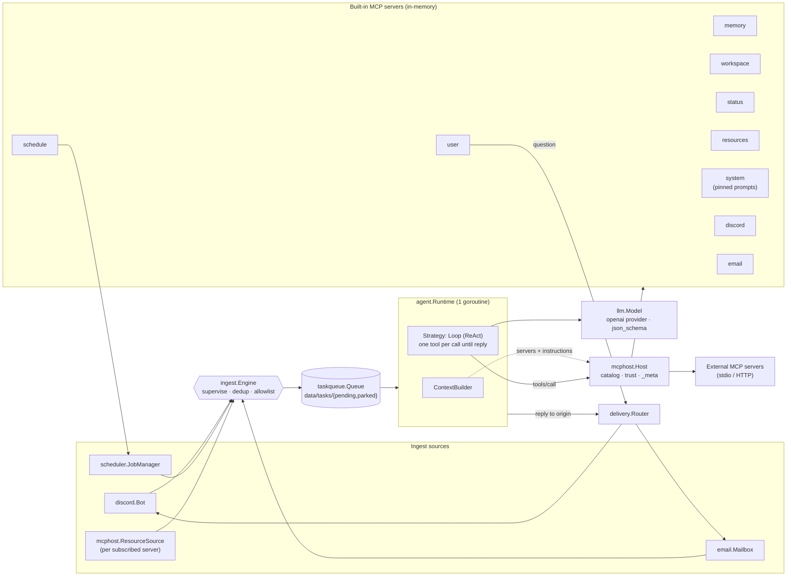

# Design

The container-level deployment diagram is in the [README](../README.md#system-design). This file covers what happens inside the `tobee` process.

## Architecture

One Go process, organized as an input side, a core, and an output side:

- **Ingest.** Sources (Discord, email, scheduled jobs, MCP resource subscriptions) emit `event.Event`s. The ingest engine supervises the sources, drops duplicates and senders that aren't allowed, and writes each event to a durable task queue (D-034).
- **Core.** A single serial runtime takes one task at a time and hands it to a reasoning `Strategy` (D-005, D-037). The runtime handles scope, the turn budget, delivery, and parking.
- **Tools.** Everything the model can do goes through the MCP host. Built-in capabilities are in-process MCP servers. External servers connect over stdio or Streamable HTTP. The model sees one catalog of `<server>_<tool>` names (D-033).
- **Delivery.** The reply to the event's origin is sent by code through the delivery router. Messages anywhere else are tool calls (D-035).

A **connector** is one package that plays all three roles for an external system. For example, `connectors/discord` is an ingest source, a delivery channel, and an MCP server.


```mermaid
flowchart LR
    subgraph sources["Ingest sources"]
        discordSrc["discord.Bot"]
        emailSrc["email.Mailbox"]
        jobs["scheduler.JobManager"]
        resSrc["mcphost.ResourceSource<br/>(per subscribed server)"]
    end
    engine{{"ingest.Engine<br/>supervise · dedup · allowlist"}}
    queue[("taskqueue.Queue<br/>data/tasks/{pending,parked}")]
    subgraph core["agent.Runtime (1 goroutine)"]
        ctxb["ContextBuilder"]
        strat["Strategy: Loop (ReAct)<br/>one tool per call until reply"]
    end
    llm["llm.Model<br/>openai provider · json_schema"]
    host["mcphost.Host<br/>catalog · trust · _meta"]
    subgraph builtin["Built-in MCP servers (in-memory)"]
        mem["memory"]
        ws["workspace"]
        sch["schedule"]
        st["status"]
        usr["user"]
        res["resources"]
        sys["system<br/>(pinned prompts)"]
        dsrv["discord"]
        esrv["email"]
    end
    ext["External MCP servers<br/>(stdio / HTTP)"]
    out["delivery.Router"]

    discordSrc & emailSrc & jobs & resSrc --> engine --> queue --> core
    ctxb -.->|servers + instructions| host
    strat --> llm
    strat -->|tools/call| host
    host --> builtin
    host --> ext
    sch --> jobs
    usr -->|question| out
    core -->|reply to origin| out
    out --> discordSrc & emailSrc
```

### Components

| Component | Package | Responsibility |
|---|---|---|
| `Event`, `Address` | `internal/event` | Normalized inbound event: ID (dedup key), source, kind (`message` / `timer` / `notification`), actor, origin address, message ID, in-reply-to, content. `ResumeKeys` builds the keys that match parked tasks. |
| `ingest.Engine` | `internal/ingest` | `Register` / `Unregister` sources at any time. Supervises each `Source.Run` and restarts it with backoff (1s doubling to 1m; reset after 1m of health). Dedups on `(source, ID)` over the last 1024 events. Applies per-source actor allowlists. `ingest` Reporter. |
| `taskqueue.Queue` | `internal/taskqueue` | Durable FIFO. One JSON file per pending task; capacity 256. A task is removed only on `Done` or `Park` (at-least-once). A task dequeued 2 times without finishing is dropped at boot. Also holds parked tasks (24h TTL). `tasks` Reporter. |
| `agent.Runtime` | `internal/agent/runtime.go` | Serial worker. For each task: attach scope, build the system message, run the strategy, then deliver the reply or park the task. |
| `Strategy` / `Loop` | `internal/agent` | A reasoning scheme: fills `Turn.Reply` or `Turn.Await`. `Loop` (`react`) is the tool-calling agent loop and the only one (D-037, D-043). |
| `ContextBuilder` | `internal/agent/context.go` | Builds the system message: prompt fragments, `<servers>`, `<context>`. |
| `Plan` / `reply` | `internal/agent/plan.go`, `reply.go` | The loop's own tools: `plan` keeps the checklist the user sees; `reply` ends the turn, rendered by `renderReply`. |
| `mcphost.Host` | `internal/mcphost` | One MCP client session per server. Aggregates `tools/list` into the catalog and refreshes on `notifications/tools/list_changed`. Routes calls with a per-call timeout (30s default) and caps results at 32 KiB. Enforces trust (D-038). `mcp` Reporter. |
| `mcphost.LoadServers` | `internal/mcphost/config.go` | Parses `MCP_SERVER_<NAME>_*` into external server configs and builds their transports. |
| `mcphost.ResourceSource` | `internal/mcphost` | Ingest source over `resources/subscribe`. Each update is read and emitted as a `notification` event. |
| `mcpserver.Server` | `internal/mcpserver` | Builder for built-in servers. Re-attaches scope from `_meta`, turns handler errors into error results, recovers panics, and carries tobee metadata (`tobee/verbatim`, `tobee/await`). |
| Built-in servers | `internal/servers/{memory,workspace,schedule,status,user,resources,system}` | `memory_*`, `workspace_*`, `schedule_*`, `status_*`, `user_ask`, `resources_*`; `system` serves the pinned prompt resources. |
| Discord connector | `internal/connectors/discord` | Gateway source (addressed-message filter, mention rewriting), `Send` / `Edit` / `React` channel with 2000-character splitting, `discord_send_message`, `discord` Reporter. |
| Email connector | `internal/connectors/email` | IMAP poller source (allowlisted senders, unseen only, ≤20 per poll, quoted history stripped), SMTP channel with `In-Reply-To` threading, `email_send`, `email` Reporter. |
| `JobManager` | `internal/scheduler` | Model-created jobs as an ingest source: robfig cron for recurring, `time.AfterFunc` for one-shots, one JSON file per job, `schedules` Reporter. |
| `delivery.Router` | `internal/delivery` | Connector name → `Channel`; optional `Editor` and `Reactor` interfaces. |
| `llm.Model` | `internal/llm` | The agent's only interface to a model: `Decide(ctx, msgs, tools)` returns exactly one tool call. `ErrInvalidDecision` marks unreadable output (D-041). |
| OpenAI-compatible provider | `internal/llm/openai` | Implements `llm.Model` with `response_format: json_schema` — no `tools`, no `tool_choice`. Builds the decision schema, sanitizes tool schemas to grammar-safe keywords, appends the tool menu, parses the choice, and reads reasoning and token usage. Bearer key optional. |
| `abilities.Registry` | `internal/abilities` | Collects `Reporter.Render` output from each subsystem, sorted by name. |
| `sandboxfs.FS` | `internal/sandboxfs` | Filesystem rooted at one directory. Rejects paths that escape it. Per-instance file size cap. |
| `telemetry` | `internal/telemetry` | Log categories, a context-carried logger for correlation attributes, content truncation, and the handler that tags untagged records `cat=system` (D-040). |
| `identity.Directory` | `internal/identity` | Links connector accounts to one person from `IDENTITY_<NAME>`. Unlinked accounts are their own person, `<connector>:<account>` (D-045). |
| `session.Store` | `internal/session` | Each person's live conversation across connectors: saved to `data/sessions/`, injected as history, archived to memory after `SESSION_IDLE_TIMEOUT` (D-046). |
| `scope.UserScope` | `internal/scope` | Connector, user, user name, channel, and thread. Travels on `ctx` in the runtime and as `_meta["tobee/scope"]` to trusted servers. `Dir()` returns the person's memory tree, `users/<person>` (or `users/<connector>/<account>` when unlinked), sanitized. |

### Wiring order (`cmd/tobee/main.go`)

1. Load `.env`. Read env vars (see the [README](../README.md#configuration--environment-variables)).
2. Create the LLM client, the memory FS (`DATA_DIR/memory`, 64 KiB cap), and the workspace areas.
3. Create the abilities registry, delivery router, task queue (`DATA_DIR/tasks`), and ingest engine. Load `IDENTITY_*` into the identity directory, give it to the engine, move any newly linked memory folders (D-045), open the session store (`DATA_DIR/sessions`, `SESSION_IDLE_TIMEOUT`, archiving through the memory server) (D-046), and create the MCP host.
4. For each configured connector (Discord if `DISCORD_TOKEN`; email if `EMAIL_IMAP_ADDR`), register its delivery channel, ingest source, allowlist, MCP server, and Reporter. Exit if there are none.
5. Create `JobManager` (`DATA_DIR/scheduler/jobs`) and register it as a source.
6. Connect the built-in servers `memory`, `status`, `schedule`, `user`, `resources`, `system` (pinned prompts; a load failure is logged, not fatal), and `workspace` (only if areas are configured). Each one's instructions come from `prompts/servers/<name>.md`.
7. Connect external servers from `MCP_SERVER_*`. A failure is logged and skipped. Register a `ResourceSource` for each server with subscriptions.
8. Load the system prompt fragments and state templates. If any are missing, log `prompts: MISSING` at ERROR and keep running.
9. Build the strategy named by `AGENT_STRATEGY` and the runtime.
10. Start the engine and the runtime. Log `tobee is running`. A source that fails to start is retried in the background; CI also waits for `discord: connected`.

## Ingest and Tasks

### Event flow

1. A source calls `emit(event)`.
2. The engine fills in `Source`, `ID`, `Received`, and `Actor.Person` if they are missing. It drops duplicates, then drops events whose actor is not on that source's allowlist. Events with no actor, such as timers, skip the allowlist.
3. `Queue.Enqueue` checks the event's resume keys against parked tasks. If one matches, the new task carries a `Resume`.
4. The task is written to `data/tasks/pending/<nanos>-<id>.json` and the runtime is signalled.
5. The runtime dequeues the task, increments `Attempts` on disk, and runs the turn. Then it calls `Done`, which deletes the file, or `Park`.

### Sources

| Source | Kind | Actor | Origin | Admission |
|---|---|---|---|---|
| `discord` | `message` | author ID / display name | `discord:<channel>` | Addressed messages only (below). `DISCORD_CHANNEL_ID` and `DISCORD_ALLOWED_USERS` narrow further. |
| `email` | `message` | sender address | `email:<sender>`, thread = Message-ID | `EMAIL_ALLOWED` (required). Unlisted mail is never fetched past the envelope and stays unread. |
| `schedule` | `timer` | the job creator | the creating channel | Always |
| `mcp_<server>` | `notification` | none | `_REPLY_TO` | Server must be `_TRUSTED` |

- **Discord addressing** (D-050). Drops messages from bots and from itself. `DISCORD_CHANNEL_ID`, when set, admits that channel and its threads; DMs are never scoped out. A message is then addressed if any rule matches, checked in this order:

  | Rule | `addressed_by` | Test |
  |---|---|---|
  | It's a DM | `dm` | `GuildID == ""` — a DM has no ambient chatter |
  | Mentions the bot's user | `mention` | `m.Mentions`, or a raw `<@id>` / `<@!id>` token |
  | Replies to one of the bot's messages | `reply` | `ReferencedMessage.Author` is the bot; also sets `InReplyTo` |
  | Names it | `name` | `\btobee\b`, case-insensitive; also catches plain-text `@TOBEE` |
  | Pings a role the bot holds | `role` | `m.MentionRoles` ∩ the bot's roles in that guild, `@everyone` excluded |
  | Is in a thread the bot is in | `thread` | the channel is a thread and `ThreadMember` finds the bot |

  The first four need no lookup. The last two use a per-guild role set and a per-channel thread record (10m TTL, dropped when the bot posts to that channel so a thread it just joined counts at once).
  - Rewrites inbound `<@id>` to `@name` and `<@&id>` to `@rolename`, so a role ping doesn't reach the model as a raw snowflake.
- **Email:**
  - Takes the first `text/plain` part; HTML-only mail is skipped.
  - Cuts the body at an `On … wrote:` line or `-----Original Message-----`, and drops `>` lines.
  - Content is `Subject: <subject>\n\n<body>`.
  - Marks fetched mail `\Seen`. If that fails, dedup absorbs the repeat on the next poll.

### Parked tasks (D-036)

- `user_ask` sends the question to the turn's origin and returns `_meta["tobee/await"] = {question, keys}`. The keys are:
  - `reply:<connector>:<channel>:<questionMsgID>`
  - `actor:<connector>:<channel>:<userID>`
  - `person:<person>`, so an answer can arrive on another connector
- A destructive tool call parks the same way, with a code-written question and the exact call stored as `Pending` (D-047).
- The executor ends the step and the turn, and the runtime calls `Queue.Park`. The parked record holds the original request, the question, the keys, and the time asked. It never holds a transcript or plan.
- A later `message` event matches reply keys first, then actor keys, then the person key; the most recent question wins. Expired records (over 24h) are deleted when found.
- The resumed turn opens with `user: <request>`, `assistant: <question>`, `user: <answer>`, then plans from scratch.
- On Discord the answer must still be addressed, and replying to the question is the natural way. On email any reply from the same sender matches.

## Sessions (D-045, D-046)

- **Who:** a person, resolved from `IDENTITY_<NAME>=<connector>:<account>,…`. Linked accounts share one session and one memory tree, `users/<name>/`. Unlinked accounts keep `users/<connector>/<account>/`. At boot, linking moves an existing account folder to `users/<name>/`; if several exist, the first moves and the rest are logged for a manual merge.
- **What:** each exchange's user messages, tool calls, and tool results (results truncated at 1,000 bytes), plus the reply as delivered. Model drafts and harness directives are not kept — including the loop's own notes, which ride in their own messages precisely so they stay out of the record (D-060).
- **Injection:** the newest whole exchanges, up to 16 KiB, go between the system message and the new request.
- **Expiry:** after `SESSION_IDLE_TIMEOUT` (default 10m) without a message, checked every 30s and on the person's next message. The session is written by code as a markdown transcript to `memory://user/.tobee/conversations/YYYY/MM/DD-HHMM.md`, then dropped. A failed archive is retried.
- **Durability:** live sessions are saved to `data/sessions/<person>.json` on every exchange and reloaded at boot.
- **Grounding:** the system prompt says earlier replies are only what was said; tool results and memory are facts. The session keeps real tool results, so later turns can check.
- **Outcomes (D-051, D-054):** each exchange also carries a code-written `Outcome` — status, steps spent, the actions taken, and what failed. It is injected after that exchange as `<outcome status="…" steps="…">…</outcome>`, and recorded in the archived transcript as `> outcome:` / `> did:` / `> failed:` lines, whenever the turn *acted*, failed, or didn't reply. So a later turn can see it already saved a file, which is how the duplicate shopping list happened. This is the Reflexion record: what was tried, what worked, what didn't — all facts, no model-written lesson.

## Tools (MCP)

### Catalog

- Tool names are `<server>_<tool>`, sanitized to `[A-Za-z0-9_-]` and capped at 64 characters. This matches the function-name pattern hosted APIs enforce. A name that collides is skipped with a warning.
- Every model call offers the whole catalog plus the loop's `reply` and `plan` (D-029).
- Each tool has a category, derived from standard MCP annotations (D-044):
  - `read`: `readOnlyHint`.
  - `write`: not read-only, and `openWorldHint: false`.
  - `external`: everything else, following MCP's defaults.

  `reply` and `plan` are `finish`. The provider's tool menu groups tools by category, with `finish` first. Categories only group tools; nothing is allowed or refused because of them. Built-in tools always send `openWorldHint` explicitly.
- `ContextBuilder` renders `<servers>`: one `## <name>` section per server, with its instructions and tool names. External servers are marked `(external)` and get no instructions.

### Built-in servers

| Server | Tools | Notes |
|---|---|---|
| `memory` | `write`, `append`, `delete`, `search`, `list`; template `memory://{scope}/{+path}`; pinned `memory://user/.tobee/lessons.md` and `memory://user/.files` | See [Memory Model](#memory-model). |
| `workspace` | `areas`, `list`, `write`, `search`; template `workspace://{area}/{+path}` | Only when areas exist. Area names, flags, and descriptions are appended to the instructions (never host paths). |
| `schedule` | `create`, `cancel`, `list`; pinned `schedule://pending` | `create` needs a connector and channel in scope. The pinned block is the user's waiting reminders (D-059). |
| `status` | `summary`, `report` | Verbatim. Reporters: `discord`, `email`, `ingest`, `mcp`, `schedules`, `tasks`. `summary` is tobee's own activity in the first person; `report` is the operator's detail (D-053). Neither is where the user's reminders or notes live. |
| `user` | `ask` | Parks the task (D-036). Needs a user in scope. |
| `resources` | `list`, `read` | The one read path for every server's resources, routed by the host (D-042). |
| `system` | none; pinned resources `system://prompt/<file>` | `prompts/system/*.md`, read fresh each turn (D-042). |
| `discord` | `send_message` | Any channel ID. Not for replying to the current conversation. |
| `email` | `send` | Allowlisted recipients only, enforced in code. |

### Trust (D-038)

| | Trusted (built-in, or `_TRUSTED=true`) | Untrusted (external default) |
|---|---|---|
| `_meta["tobee/scope"]` sent on calls | yes | no |
| Instructions in the system prompt | yes | no (name and tools only) |
| `tobee/verbatim`, `tobee/await` honored | yes | no |
| May feed tasks via `_SUBSCRIBE` | yes | no (config rejected) |

- A stdio server's process gets only `PATH`, `HOME`, and its `_ENV_*` values.
- Tool output from any server is capped at 32 KiB. Non-text content blocks are named, not dropped.

## Turn Lifecycle (`Loop`, D-043)

### Conversation shape (one request)

```
0    system  pinned resources + <servers> + <context>
…    …       session history: earlier exchanges of this person's live conversation (D-046)
1    user    the user's message, verbatim, untagged     (resumed: request, assistant question, answer)
2    user    <phase name="turn">…</phase>
3    asst    tool call: <one tool>                      offered: reply, plan, catalog
4    tool    <result or "error: …">
             ── repeat until reply, a user_ask, or the step budget ──
N    asst    tool call: reply                           ends the turn
```

### The loop

1. Append the request messages and the one `turn` directive, which is kept separate (D-029).
2. Each iteration is one model call offering `reply`, `plan`, and the catalog:
   - **`reply`** renders `spoken`, `artifacts`, and any verbatim blocks, and ends the turn. A greeting is one call.
   - **`plan`** stores the checklist and acknowledges `ok`. It is shown only on connectors that can edit the message, and only with two or more steps; later calls edit it.
   - **A destructive tool** (MCP `destructiveHint`, true by default for non-read-only tools) doesn't run. The loop sends a code-written "Confirm: <tool> <args>" question and parks the task with the exact call. On resume, a plain yes runs that call unchanged; anything else cancels it. Either way, the model then continues (D-047).
   - **Any other tool** runs through the host and its result is appended. A verbatim result tells the model it is already shown. A `user_ask` result ends the turn so the runtime can park it (D-036).
   - **A verbatim result closes every verbatim tool** for the rest of the turn: the answer is rendered, and a second rendering is noise (D-060).
   - **A call whose arguments were already used** returns the earlier result, and a note in its own message asks for different arguments or a different tool, and is not run again. The same tool with *different* arguments always runs: widening a search that came back empty is the right next move. Only a tool refused `maxSuppressed` (2) times is closed, by leaving it out of the next call's schema, which is the last way to break a stuck loop (D-051). Any non-read call clears both records.
   - **Every non-read call is recorded as an action** with its real outcome.
3. Before each call the loop checks whether the turn has stalled: three consecutive calls that returned nothing new, a conversation past the size backstop, or less than the reply reserve left on the clock (D-057). Any of those appends the nudge and makes one last call offering only `reply`. If that fails, the verbatim blocks and the problem list are delivered on their own.
4. The runtime delivers `Turn.Reply`: non-empty clears the progress reactions; empty adds ❌. A parked turn clears its reactions.
5. The runtime records the exchange in the person's session. It records this turn's user, tool-call, and tool-result messages; the reply is stored as the delivered text. Harness directives are left out. Parked turns are recorded when their task finishes.

Replying to the origin is never a tool, and the send tools refuse the current conversation in code (D-035). An earlier design let `discord_send_message` answer the channel it was in, which duplicated the reply.

### Progress feedback

| Signal | Where | Values |
|---|---|---|
| Ping on the reply | `timer` turns on a connector with a mention syntax | The actor's connector user ID, e.g. `<@264…>` (D-054) |
| Reactions on the inbound message | Events with a `MessageID` on a connector that supports reactions (Discord) | ✅ received → 🧠 thinking → 💭 using tools. Cleared on success or park; ❌ on failure. |
| Plan message | Only when the model calls `plan` with 2+ steps, on connectors with edit support | ⏳ pending, 🔄 active, ✅ done, ⏭️ skipped |

### Budgets and limits

| Limit | Value | Source |
|---|---|---|
| Turn wall-clock budget | 2m | `AGENT_TURN_BUDGET` |
| Model calls per turn | unbounded | Ended by stalling or the clock, not a count (D-057) |
| Consecutive calls returning nothing new | 3 | `agent.maxStaleCalls`, then one reply-only call |
| Conversation size backstop | 192 KiB | `agent.maxConversationBytes` |
| Reply reserve off the turn budget | 15s, capped at ¼ of the budget | `agent.replyReserve` |
| Search block span | 40 lines | `sandboxfs.maxBlockLines` |
| File size searched | 1 MiB | `sandboxfs.maxSearchFileSz` |
| LLM HTTP timeout / max tokens | 10m / 2048 | `AI_TIMEOUT` / `AI_MAX_TOKENS` (the turn context cancels first) |
| Temperature | 0.1 | `AI_TEMPERATURE` (`openai.DefaultTemperature`) |
| Tool call timeout | 30s | `MCP_SERVER_<NAME>_TIMEOUT`; built-ins use the default |
| Tool result size | 32 KiB | `mcphost.maxResultBytes` |
| Task queue capacity | 256 pending | `main.go` |
| Task attempts | 2 | `taskqueue.maxAttempts` |
| Parked task TTL | 24h | `taskqueue.ParkTTL` |
| Dedup window | 1024 events | `ingest.dedupSize` |
| Discord channel/thread record | 10m | `discord.channelInfoTTL` |
| Source restart backoff | 1s → 1m | `ingest` |
| Email per poll / body | 20 messages / 16 KiB | `connectors/email` |
| Memory / workspace file size cap | 64 KiB / 256 KiB | `main.go` / `WORKSPACE_MAX_FILE_SIZE` |
| Status window | default 1h, max 30d | `internal/servers/status` |
| Discord message length | 2000 chars | `discord/split.go` |

## Reasoning Patterns

| Pattern | Where it appears |
|---|---|
| **ReAct / tool-calling agent loop** | One tool per model call, results appended, until `reply`. The same shape as the OpenAI Agents SDK runner or LangGraph's tool-calling agent. |
| **Answer as a tool** | `reply` is a tool the model chooses when it can answer, so a trivial message is one call and no separate synthesis pass exists. |
| **Model-maintained checklist** | `plan` is a todo list the model sets and updates, like Claude Code's todo tool, and only for multi-step work. |
| **Human-in-the-loop clarification** | `user_ask` suspends the task and resumes on the answer, like LangGraph's `interrupt`, with state limited to request + question. |
| **Constrained decoding (structured output)** | Every call sends a JSON Schema admitting exactly one call to one offered tool; the server enforces it by grammar. |
| **Corrective retry ("re-asking")** | Unreadable output is dropped, a short nudge is appended, and the call is retried once. |
| **Coarse-to-fine retrieval** | `count=true` (or `memory_list name=`) finds the documents, `context=N` or a `#L..` range reads the part that matters. Two-stage retrieval with the loop as the retriever (D-056, D-061). |
| **Progress-based termination** | A turn ends when it stops learning, not after N calls (D-057). |
| **Tool errors returned to the model** | A tool error becomes the tool result (`error: …`) and the model decides what to do next. |
| **Content/presentation separation** | `reply` provides `spoken` and `artifacts`; Go writes the code fences. |
| **Return-direct passthrough** | Output from verbatim tools is appended by code and never rewritten by the model. Same idea as LangChain's `return_direct`. |
| **Spotlighting** (delimiting) | The harness directive is wrapped in a `<phase>` tag; user text never is. |
| **Tool-driven memory recall** | Facts, preferences and transcripts are never pre-loaded; the model reads `memory://` resources (D-052). |
| **Deferred action as a full turn** | A fired reminder runs the whole loop and retrieves its own context rather than being delivered by code, so every feature gets context the same way (D-059). |
| **Reflexion** | A closed session that failed is distilled into a few verbal lessons, written to the core memory tier and pinned into later prompts. Shinn et al.'s loop, with the actor's own recorded outcomes as the evidence (D-051, D-052). |
| **Core / archival memory split** | A small always-present block plus a larger searched store, as in MemGPT/Letta core vs archival memory (D-052). |

### Retry and failure handling

| Failure | Handling | Exhausted |
|---|---|---|
| Unreadable output (`ErrInvalidDecision`) | Dropped; nudge; retry. At most 1 per turn. | Turn ends with no reply; ❌ |
| Model call error | Retry once per turn | Turn ends with no reply; ❌ |
| Tool call error, timeout, panic (recovered in built-ins) | No retry; sent to the model as `error: …` | — |
| Step budget spent | One reply-only call | Verbatim blocks and the problem list, else ❌ |
| Any of the above | Recorded on the turn as a `Problem`; unrecovered ones are rendered under the reply and all are saved to the session (D-051) | — |
| Source | Restart with backoff, forever | Logged; `ingest` Reporter shows `down` |
| Task | Redelivered after a crash, up to 2 attempts | Dropped at boot with an ERROR |
| Plan message, react, send | No retry | Logged; turn continues |

Violations (output that was not a valid tool choice, `llm.ErrInvalidDecision`) are logged at ERROR as `agent: PROTOCOL VIOLATION` (`cat=llm`) with `phase`, `err`, `raw_chars`, `raw_preview`. With constrained decoding they mean the server ignored the schema. The unreadable output is never appended to the conversation.

### Model calls (D-041)

Each call is `llm.Model.Decide(ctx, messages, tools)`. The OpenAI-compatible provider:

1. Builds a schema: `{"call": {"tool": <const name>, "arguments": <that tool's schema>}}`, with one `anyOf` branch per offered tool. `tool` precedes `arguments` so the model names its choice first. The root is an object because hosted APIs require one.
2. Sanitizes each tool schema to `type`, `properties`, `required`, `items`, `enum`, `const`, `anyOf` (from `oneOf`), bounds, and boolean `additionalProperties`. `$ref`, `pattern`, `format`, and descriptions are dropped.
3. Appends a `<tools>` menu as the last user message: each tool's name, description, and arguments in compact form. The schema constrains the output, but the model never sees it. The menu is per-request and never stored.
4. Sends `response_format: {type: "json_schema", json_schema: {schema, strict: false}}`, with no `tools` and no `tool_choice`. On Ollama this becomes the grammar-constrained `format`.
5. Parses `call` into a tool call with a fresh ID. A native `tool_calls` answer from a server is accepted as the same choice. Anything else is `ErrInvalidDecision`.

The conversation keeps standard tool-call form (an assistant message with `tool_calls`, then `tool` results), so it is valid history for every OpenAI-compatible server.

## Logging (D-040)

Every record has a `cat` attribute. Records from a turn also carry `task`, and records from a model call or tool call carry `step` (the loop iteration). The attributes ride on a logger in the context (`telemetry.With`).

| `cat` | Level | Record (`msg`) | Content |
|---|---|---|---|
| `input` | INFO | `agent: input` | Event source, kind, connector, channel, user, `content`; on a resumed task also `resumes`, `request`, `question` |
| `thinking` | INFO | `agent: reasoning` | The model's separate reasoning (`reasoning_content` / `reasoning`), when the server returns it |
| `thinking` | INFO | `agent: model text` | Any text the model wrote alongside its tool call |
| `thinking` | INFO | `agent: plan` | `goal`, `steps` (`status: title`) |
| `action` | INFO / WARN | `agent: tool call` / `tool result` | `tool`, `call_id`, `args`; `status` (`ok` / `verbatim` / `await` / `error` / `failed`), `duration_ms`, `content` |
| `output` | INFO | `agent: output` | `kind` (`reply` / `plan` / `question`), destination, `content` |
| `llm` | INFO | `agent: llm call` | `duration_ms`, `prompt_tokens`, `completion_tokens`, `finish`, `tool_calls` |
| `llm` | ERROR | `agent: llm call failed`, `agent: PROTOCOL VIOLATION` | Error, or the unreadable output's preview |
| `llm` | DEBUG | `agent: llm message` / `llm response` | Each message added since the previous call, and the raw response, unabridged |
| `system` | any | everything else | Lifecycle, connectors, ingest, MCP host |

- A turn's INFO trail runs input → thinking / action → output, so it can be read without DEBUG. DEBUG adds the exact prompt, logged incrementally rather than re-printing the transcript on every call.
- `content`-style fields are cut at `LOG_CONTENT_LIMIT` bytes (default 4000; 0 = unlimited), with a `<field>_chars` companion holding the full length. DEBUG message logs are never cut.
- Reasoning is logged but never sent back to the model.
- `LOG_FORMAT=json` makes categories filterable with `jq`; in text, `grep cat=<category>`.

### Output formatting (`renderReply`)

The model writes item 1 and item 2. Code writes item 3 and item 4, so what the reply says about the world matches what happened.

1. Trimmed `spoken` text.
2. Each non-empty artifact as ```` ```<lang>\n<body>\n``` ````.
3. Each verbatim block: single-line output is appended as plain text; multi-line output is wrapped in a bare code fence. Blocks with identical text appear once per turn.
4. One line per action taken this turn: `✅ <tool>: <first line of the result>` or `❌ <tool>: <error, or "not run: not approved">` (D-047).
5. `⚠️ I didn't finish this cleanly:` and one bullet per unrecovered problem, each a first-person sentence written where the fact was known (D-053). A repeat the loop absorbed is recovered, so a turn that answered correctly says nothing about it; a stalled or timed-out turn promotes every recorded problem, since the wasted calls are then why the answer is thin (D-055, D-057) — a tool error (reads included), a repeat that closed a tool, a spent step budget, a declined approval, a model failure. A retry that worked is recorded but not shown (D-051).
6. Connector rendering. Discord turns outbound `@displayname` into `<@id>`, then splits at ≤2000 characters. Preferred break points, in order: after a closing fence, a paragraph break, a sentence end, a newline, then a hard cut. Email sends the text as a plain-text body.

## Prompt Architecture

- **System message** (built once per request, `ContextBuilder.ComposeSystem`), in order:
  1. Pinned resources from trusted servers, highest priority first, capped at 32 KiB, read fresh each turn: `prompts/system/*.md` from the `system` server at priority 1 (identity, voice, behaviour, safety, tools), then from the `memory` server the current user's `lessons.md` as `<lessons>` (0.6; guidance, not fact — D-052) and their saved paths as `<memory-files>` (0.5; names only, transcripts counted — D-054), then the `schedule` server's `<reminders>` (0.4; what is waiting — D-059). A turn with no user pins none of the three.
  2. `<servers>`: each connected server's name, trusted instructions, and tool names. Built-in instructions are `prompts/servers/<name>.md`. The workspace server appends its area list.
  3. `<context>`: `now` (RFC3339 plus a readable date and time), `tz=<IANA zone>`, source, kind, connector, channel, thread, and user name and ID, or `user=none`. The zone is what lets "4:40pm" become an instant (D-049).
- **Turn directive** is one user-role message rendered from `prompts/state/turn.md`, wrapped in `<phase name="turn">`. It takes the event's `Kind`, so a `timer` turn is told the note it left itself has come due — one template, no second phase (D-043, D-053).
- **Prompts carry no call syntax, and no worked arguments.** No `tool({args})` examples anywhere: the local model copied them as text instead of making a tool call (2026-09-28). A literal argument value is copied too — an instruction reading `name="Shopping List"` produced a real search for "shopping list" mid-way through a conversation about reminders (D-062). Tool names appear bare, arguments are described in words, and `TestPromptsCarryNoCallSyntaxOrWorkedArguments` enforces it rather than leaving the rule as prose.
- **What each file owns.**
  - `prompts/system/` holds rules true for every turn.
  - `prompts/servers/` holds how to use one server.
  - `prompts/state/turn.md` holds how to work a turn: reply early, plan only multi-step work, ask when unclear.
  - Phase rules placed in the system prompt leak into other phases.
- **Prefix caching.**
  - Across turns, sections 1–2 are identical until a server connects, disconnects, or changes its tool list.
  - `<context>` changes every turn.
  - Within a turn, message 0 never changes and the list only grows.

## Memory Model

### Taxonomy (loosely CoALA)

| Kind | Lives at | Written by | How it reaches the model |
|---|---|---|---|
| Working | The current turn's `Conversation`; never saved | The strategy | In the prompt |
| Episodic | The person's live session, then `conversations/YYYY/…` | Code (D-046, D-051) | Injected while live; tool-read once archived |
| Semantic | `user.md`, `facts/*.md` under a scope | `memory_write` / `memory_append` | Tool-read (D-052) |
| Procedural | `preferences.md`, `feedback/*.md` under a scope | `memory_write` / `memory_append` | Tool-read (D-052) |
| Core | `lessons.md` under the user scope, capped at 1 KiB | The reflection pass (D-052) | Pinned into every system prompt |
| Scheduled | No file: the job store under `data/scheduler/jobs/` | `schedule_create`, `schedule_update` | Pinned as `<reminders>`, derived per read (D-059). An existing reminder is edited by id, never re-created (D-063) |
| Structural | No file: the list of paths under the user scope | — (derived) | Pinned as `<memory-files>`, capped at 1 KiB (D-054) |

Episodic memory is the person's live session, recorded by code and archived to `conversations/` on idle (D-046); the model never writes a summary of it (D-027). The one thing the model does write about the past is a lesson from a failure, and only into the capped core tier (D-052). Parked tasks keep only a request and a question, for up to 24h (D-036).

### Layout

```
data/
├─ memory/                           # the only tree any tool can reach
│  ├─ shared/                        # scope="shared"
│  └─ users/<person>/                # scope="user": a linked person's name, or <connector>/<account>
│     ├─ .tobee/                     # code-owned: readable and searchable, never writable (D-055)
│     │  ├─ lessons.md               # core tier: pinned, capped at 1 KiB (D-052)
│     │  └─ conversations/YYYY/MM/DD-HHMM.md   # session transcripts (D-046)
│     └─ …                           # user space: the model's to write
├─ scheduler/
│  └─ jobs/<id>.json                 # one file per job; ids are "j-<8 hex>"
├─ sessions/<person>.json          # live conversations (D-046)
└─ tasks/
   ├─ pending/<nanos>-<id>.json      # queued and in-flight tasks; ids are "t-<8 hex>"
   └─ parked/<id>.json               # questions waiting on an answer
```

- The prompts name only `INDEX.md` as the table of contents. File layout within a scope is left to the model.
- Paths are written exactly as given (D-048). `conversations/` holds session transcripts written by code.
- An unlinked email user gets their own tree, keyed by address: `users/email/me_example_com/`. Linking that address to a Discord account with `IDENTITY_<NAME>` gives both one tree, `users/<name>/` (D-045).

### Tools

| Tool | Args | Default scope | Notes |
|---|---|---|---|
| `resources_read` | `uri`, optionally with a `#L<from>-<to>[,…]` fragment | — | The read path; `user` resolves to the current user's tree. A fragment returns only those spans, each under a header naming it (D-056) |
| `memory_write` | `path`, `content`, `scope` | `user` | Path used as given; overwrites. Refused inside `.tobee/` (D-055), and refused when an existing file is plainly the same thing — a directory segment matching a file, or a sibling with the same name in another spelling (D-054) |
| `memory_append` | `path`, `content`, `scope` | `user` | Path used as given; creates if missing |
| `memory_delete` | `uris` | — | Destructive: runs only after the user approves (D-047). Files only, never directories, never anything in `.tobee/` (D-055). |
| `memory_grep` | `pattern`, `loose`, `regexp`, `word`, `case`, `count`, `context` (0-10), `dir`, `history`, `limit` (20), `scope` | `both` | Real `grep` run inside the scope (D-061). Name matches first, then `<uri>:<line>  <text>`; `count=true` is the coarse rung (`<uri>  N matches`) and `context=N` gutters the lines either side. Literal unless `regexp`; `loose` lets separators stand for each other. Saved conversations need `history=true` and come last (D-056, D-060) |
| `memory_list` | `dir`, `name`, `scope` | `both` | `<scope>:<path>`. `name` filters by filename with case and separators ignored, so `name="Shopping List"` finds `shopping_list.md` (D-061) |

- `scope="user"` (or `memory://user/…`) on a turn with no user attached (a resource notification) returns an error telling the model to use `shared`.
- Paths are confined to their scope root before `sandboxfs` sees them: `..` that leaves the scope is rejected (D-013). `sandboxfs` alone only confines to the whole memory tree.
- List, grep, write, and append results are `memory://` URIs, so any result can be read directly.
- `both` covers `shared` plus the current user's tree only. Other users' trees are never searched or listed.

### Safety

- **Path sandbox** (`sandboxfs.resolve`) rejects empty, absolute, volume-qualified, and `..` paths, then re-checks the result with `filepath.Rel`. All memory and workspace operations use it. It is also what keeps `data/sessions/`, `data/tasks/` and `data/scheduler/` out of reach: the memory FS is rooted at `data/memory`, so nothing above it is addressable (D-055).
- **Reserved area** (D-055). `.tobee/` in any scope is written only by code — `ArchiveTranscript` and `AppendLessons` go through the FS directly, not through a tool. The tool handlers refuse it on the scope-relative path after cleaning, so `notes/../.tobee/lessons.md` is refused too, and `memory_delete` refuses any path with a `.tobee` segment in any scope.
- **Size caps** are enforced on `Write` and on the combined size after `Append`.
- **No approval gate.** The model writes what it judges useful.
- **Tool results are data, not instructions.** This is prompt guidance only (`04-safety.md`). No code-level framing is applied to tool results.
- **Curating `INDEX.md`** is expected to be a human task. Nothing enforces this. `lessons.md` is the same: plain text, editable, and deletable if a lesson is wrong (D-052).

## Other Subsystems

- **Memory search:** a name match returns the file's first `namePreviewLines` (12) lines, gutter-numbered so a line number can become a `#L..` read, then `… N more lines` when there are more. A content hit still reports `<uri>:<line>  <text>` and is not previewed (D-064).
- **Scheduled jobs:**
  - `schedule_create` requires the turn scope to have a connector and a channel. Takes `at` (RFC3339 or `in <duration>`) or `cron` (5-field or `@every` / `@hourly` / …, no seconds). Its result names the fire time in local wall-clock terms (`fires 4:49pm PDT today`) followed by the exact instant, because that line is what the user reads under the reply (D-047, D-049).
  - `schedule_update` changes a pending job in place by id, keeping it the same reminder. Only the fields passed change; `at` and `cron` clear one another. The patch is validated on a copy before the live timer is touched, so a rejected edit leaves the existing reminder running (D-063).
  - `schedule_create` refuses a prompt that is plainly a duplicate of one of the same user's pending jobs — equal once case, punctuation and spacing are ignored, or one wholly contained in the other, above a 10-character floor — and names the clashing id (D-054, D-063).
  - A fired job emits a `timer` event with the original connector, channel, thread, user, and user name. The content is `[reminder due: <name>] <prompt>`. It runs as an ordinary turn: the directive tells it to do what the note asks before answering, to search memory for the note's words when it needs the background the job record never held, and to say the reminder the way a person would rather than describe the schedule (D-053, D-059). The event ID is `<job>@<unix>`.
  - Pending jobs for the turn's user are pinned as `<reminders>`, derived from the job store on every read and capped at `pendingMax` (10). Nothing is written to memory and nothing is removed on firing (D-059).
  - One-shots are deleted after firing. At boot, one-shots whose time has passed are deleted without running (misfire policy: skip).
  - A job that comes due while the source is stopped is skipped and left on disk for the misfire policy.
  - The job file keeps the JSON key `integration` for the connector name, so jobs saved before D-034 still load.
- **Status:**
  - `status_report` renders `tobee status — window <since> → <now>`, then a `## <reporter>` section for each reporter with Doing / Done / Waiting lines, or `(idle)`.
  - `status_summary` joins each reporter's non-empty sentence, or returns `I've been idle — nothing to report.` Each sentence is first-person and about activity; a reporter with nothing to say returns `""` rather than describing what is connected (D-053).
  - The `ingest`, `mcp`, `email`, and `tasks` reporters show lifetime counters; `window` only narrows `discord` and `schedules`.
- **Workspace areas:**
  - Defined as `WORKSPACE_AREA_<NAME>` (root), `_DESC`, `_READONLY` (`1` / `true` / `yes` / `y` / `on`). The name is lowercased.
  - `workspace_grep` defaults to `area="all"` and takes the same options as `memory_grep`. `workspace_write` rejects read-only areas and date-stamps filenames.
  - Env entries without a root are reported as a warning at boot.

## Key Decisions

Decisions currently in force. IDs are cited in code comments; don't renumber. Superseded entries are listed in [IMPLEMENTATION.md](IMPLEMENTATION.md#superseded-decisions).

| ID | Decision | Why | Cost / constraint |
|---|---|---|---|
| D-001 | Tool calls are structured, never parsed out of prose. (Transport superseded by D-041: structured output rather than native `tools`.) | The earlier JSON-in-text protocol needed retry loops for fences, `<think>` leaks, and drift. | The model and server must support function calling. |
| D-002, D-018 | Packages under `internal/`; binary at `cmd/tobee`; module `github.com/runyanjake/tobee`. | Idiomatic Go layout. | — |
| D-003 | Memory is sandboxed under `data/memory` through `sandboxfs`. | The agent writes without approval, so damage must be bounded. | No arbitrary host-file access except through workspace areas. |
| D-005 | Single serial agent worker, now draining the task queue. | No races on memory writes; replies stay in order. | One turn blocks all others for up to the turn budget. |
| D-007 | No `!command` prefix control plane. | It turned into a second control plane. | Poking tools requires Go tests or a live LLM. |
| D-008 | `data/` is fully gitignored; no seed files. | Memory is private to each install. | Fresh installs start empty. |
| D-012 | System prompt fragments are `prompts/system/*.md`, ordered by numeric prefix; since D-042 they arrive as pinned resources. | Fragments are easy to edit. | Order is a filename convention. |
| D-013 | Memory split into `shared/` and a per-user tree; scope travels on `ctx` and in `_meta`. The tree is keyed by person since D-045 (`users/<person>/`, or `users/<connector>/<account>/` when unlinked). | Per-user isolation without a user table. | Search and list must never cross user trees. |
| D-014, D-021 | Subsystems expose `Reporter.Render → (full, summary)` text; status tools compose it. | Consistent wording; no reach-in coupling. | Reporters format their own text. |
| D-015 | Model-created jobs: one JSON file each, robfig cron plus `AfterFunc`, replayed at boot, misfire skip. | Reminders must survive restart and route back to the originating channel. | Missed one-shots are dropped silently. |
| D-017 | Stable sections first in the system message. | Prefix caching on the LLM server. | Reordering sections must keep the stable-first order. |
| D-019 | Workspace areas: operator-configured sandboxed roots; list carried in the workspace server's instructions. | Access limited to directories the operator opts in; no discovery calls needed. | Area names and descriptions are visible to the model. |
| D-025 | Every model output is a tool call; one nudge-and-retry; no text fallbacks. | Every text escape hatch became a class of "the model decided" bugs. | An unreadable call costs a retry. |
| D-027 | Superseded by D-046: history is a code-recorded session per person, not a model-written summary or a per-channel ring buffer. | — | — |
| D-029 | One `Conversation` per request; the harness directive is its own `<phase>`-tagged message; every call offers every tool. | One system message enables prefix caching; the user's words are never mixed with directives. | The whole transcript is resent on each call. |
| D-030 | Verbatim output is enforced in code, now as `tobee/verbatim` tool metadata honored for trusted servers; clock stamped in `<context>`; status takes a relative `window`. | "Relay verbatim" in prose was ignored; the model invented windows and state. | Only a short lead-in is written by the model on status turns. |
| D-033 | MCP is the only tool plane. Built-ins are in-process MCP servers; the host aggregates `tools/list` into one catalog named `<server>_<tool>`; server instructions (from `prompts/servers/`) replace the hand-written catalogue. The loop adds its own tools, `reply` and `plan`. | One path for built-in and third-party tools; the catalog can't drift from what's callable; names valid on every OpenAI-compatible backend. | In-process servers can't see the turn's `ctx`, so scope rides in `_meta`. Tool renames touched every prompt. |
| D-034 | Input is an ingest engine of `Source`s feeding a durable task queue. Sources register and unregister at runtime and restart with backoff; events are deduped and allowlisted per source; tasks are on disk until done, at most 2 attempts. | Any number of inputs (chat, mail, timers, MCP notifications) through one path; nothing lost on restart or while a long turn runs. | At-least-once: a crash mid-turn can repeat a reply. A bad token now retries instead of exiting. |
| D-035 | A connector is one package that is a source, a delivery channel, and an MCP server. The reply to the origin is sent in code; messages elsewhere (`discord_send_message`, `email_send`) and questions (`user_ask`) are tools. Plans are announced only where edits work. | The default reply can't be skipped or reworded; the model can still reach people deliberately. | Two ways to send text; prompts must say which is which. |
| D-036 | Clarifying questions park the task. `user_ask` sends the question and returns `tobee/await` keys; an answer matching a reply key (or, failing that, the same user in the same channel) within 24h resumes it as request → question → answer. | Blocking inside a 2-minute turn can't wait for a person; a full transcript would reintroduce session state. | The resumed turn replans from scratch. A user's unrelated next message in that channel can be taken as the answer. |
| D-037 | Reasoning schemes implement `Strategy`; the `react` loop is the only one; `AGENT_STRATEGY` selects it. | The operator wants to try other schemes without touching the runtime. | An interface with one implementation, by explicit choice. |
| D-038 | Trust is per MCP server. Built-ins are trusted; external servers are untrusted unless `_TRUSTED=true`: no scope in `_meta`, no instructions in the prompt, no verbatim/await, no subscriptions. Stdio servers get a minimal environment. Email is allowlisted inbound and outbound. | Third-party servers and inboxes are the widest prompt-injection surface; the system prompt is the most privileged place text can land. | Untrusted servers get less context and may be less useful. |
| D-039 | The LLM backend is configuration: `AI_PROVIDER_URL`, `AI_MODEL`, `AI_API_KEY`, `AI_TEMPERATURE`, `AI_MAX_TOKENS`, `AI_TIMEOUT`. The OpenAI-compatible chat API is the contract. | Switching models or hosts is planned; no code change should be needed. | Backends without an OpenAI-compatible endpoint need a proxy. |
| D-040 | Logs are categorized by the reasoning chain: `input`, `thinking`, `action`, `output`, plus `llm` and `system`, with `task` / `step` correlation from a context logger. The INFO trail carries content (capped by `LOG_CONTENT_LIMIT`); DEBUG adds the exact prompts, logged incrementally. | One turn's input, reasoning, actions, and output must be reconstructable and filterable without DEBUG; the old DEBUG dump re-printed the whole transcript per call and dropped model reasoning. | User messages and tool output are in INFO logs; lower `LOG_CONTENT_LIMIT` to trim them. |
| D-041 | The agent reaches a model only through `llm.Model.Decide`, which returns exactly one call to one offered tool. The OpenAI-compatible provider enforces this with `response_format: json_schema` (grammar-constrained on Ollama), not `tools` / `tool_choice`; a per-request tool menu describes the options. Unreadable output is never kept. `AI_PROVIDER` selects the provider. | Ollama ignores `tool_choice`, so the model answered in prose or wrote calls as text (the long-standing protocol violations). Constrained decoding makes that impossible, and one interface keeps request shape and server quirks out of the agent. | One tool call per model call. The tool menu adds prompt tokens at the tail of every request. Needs a server with `json_schema` support. `llm.Model` has one implementation, by choice. |
| D-042 | Servers expose readable content as MCP resources and resource templates, with URIs that mirror the folder tree (`memory://user/…`, `workspace://<area>/…`). The model reads any of them through the one `resources_read` tool; per-server read tools are gone. Resources a trusted server pins (any priority above 0) go into every system prompt, highest priority first, capped at 32 KiB; `prompts/system/*.md` from the `system` server pins at 1, and memory's per-user blocks below it so the stable prefix stays cacheable (D-017, D-054). | One read path for built-in and third-party content; files stay human-editable; the system prompt uses the same mechanism as any other context. | Pinned resources are read every turn. From memory only the capped lessons file and file manifest are pinned (D-052, D-054). Untrusted servers cannot pin (D-038). |
| D-043 | A turn is one tool-calling agent loop (ReAct): each model call picks one tool from the catalog plus the loop's own `reply` and `plan`, until `reply`. `plan` is a model-maintained checklist shown only for 2+ steps where it can be edited. Out of steps, one reply-only call. | The fixed plan → announce → execute → synthesize sequence turned a greeting into a one-step plan, a checklist, and two replies. With `reply` as a tool, simple turns cost one call and there is no separate synthesis. | Multi-step structure depends on the model choosing to call `plan`. No per-step budget; `AGENT_MAX_STEPS` bounds the turn. |
| D-044 | Tool categories are derived from standard MCP annotations: `read` (readOnlyHint), `write` (openWorldHint false), `external` (otherwise); the loop's tools are `finish`. They group the tool menu and nothing else. | Helps the model tell answering from acting without a custom MCP field; works for third-party servers that annotate. | Annotations are hints; untrusted servers can mislabel tools, which is why categories never gate anything (D-038). |
| D-045 | A person is a set of linked connector accounts (`IDENTITY_<NAME>`). Sessions, memory (`users/<person>/`), and parked-question matching key on the person; unlinked accounts are their own person. | Conversations move between Discord, email, and texting; memory must follow the human, not the account. | Linking moves the old account folder at boot; several old folders need a manual merge. |
| D-046 | Each person has one live session: their messages, tool calls with real results, and delivered replies, injected as history until `SESSION_IDLE_TIMEOUT` of inactivity. Then code archives it as a markdown transcript in memory. | Follow-ups ("delete these") need the previous turn. D-027's failures came from per-channel buffers mixing users and model-written summaries; this is per person and records only what happened. | Up to 16 KiB of history per call. A long idle gap loses context by design. |
| D-047 | Grounding is enforced in code. Every non-read call becomes an action line under the reply with its real outcome. Destructive calls (`destructiveHint`, MCP default true) run only after a plain yes to a code-written confirmation, exactly as proposed. Identical repeated reads return the earlier result. | The model claimed deletions it never made (no tool existed) and wrote a "removed files" note instead; prompts can't prevent that. | An extra round trip for every destructive call. Unannotated third-party tools ask first. |
| D-048 | Memory and workspace paths are written exactly as given; no date prefix or renaming. | Date-stamping made `INDEX.md` unreachable (it became `2026.07.20-index.md`) and doubled dates in names. | Dated file names are now the model's choice. |
| D-049 | The instance has one wall clock, set by `TZ`: `main` pins `time.Local` at boot, `<context>` stamps `now`, the readable time, and `tz=<zone>`, and every time a person reads (reminder confirmations, `schedule_list`, status reports) is local. | The container has no zone, so everything was UTC. The model was asked to turn "4:40pm" into an instant with no offset to convert from, and set a reminder 9 minutes off; the confirmation then read `23:49:47Z`, which no one can check at a glance. | `TZ` is now instance config in three places (`.env`, `.env.prod`, `Jenkinsfile`). Logs move to local time too. One instance has one zone; a user in another is not modelled. |
| D-064 | Three fixes to the same shape of fault: a step has to leave the turn able to take the next one, and the reply has to say each thing once. **A name match carries the file's opening lines** (12, then a count of the rest), restoring what D-060 had and the grep migration dropped. **An artifact that repeats `spoken` or a verbatim block is dropped**, extending D-062 from the spoken line to the blocks. **`status_summary` is no longer verbatim**: it returns the sentence for the model to pass on, while `status_report` stays verbatim. | "What is in my shopping list?" matched `shopping_list.md` by name — the phrase is nowhere in "- Milk", "- Bread" — and the result was the bare URI. With nothing to act on, the model called `memory_grep` four more ways for the same line until the stall guard stopped the turn, then answered from conversation history and put the list in `spoken` **and** in `artifacts`, so the user read it twice and neither copy came from a tool. Separately, a verbatim result is appended whether or not the reply is about it, so a stray summary call ended unrelated answers with "I've handled 3 messages on Discord". | A preview costs a read per name match and can show the top of a file nobody wanted. The dedupe is containment after normalising case and spacing, so a block deliberately quoting what was just said is dropped. The summary's numbers now reach the user through the model's own words, so they can be reworded — the trade D-030 made the other way, accepted because an always-appended summary is a certain harm and a reworded count is a possible one. |
| D-063 | A reminder is edited, not re-created. `schedule_update` patches a pending job by id — only the fields passed, `at` and `cron` clearing one another — validating a copy before the live timer is touched. `schedule_create` refuses a prompt that duplicates one of the same user's pending jobs and names the id, and its description says to update rather than create when something already exists. | Asked to move a reminder to 1pm, the model called `schedule_create` again: both jobs stayed scheduled, and the second one's prompt was the user's instruction — "Change the reminder to 1pm instead of 3:30pm" — so the actual task, texting Darren about basketball, was gone from the thing that would fire. There was no tool for an edit, so the only move available was the wrong one. | A duplicate test on text can refuse a legitimately new reminder whose wording overlaps an existing one; the refusal names the id and a reworded prompt still goes through, since it is per argument set (D-051). It does **not** catch the case that prompted it — that prompt was different text — so the fix there is the update tool and the create description, not the guard. `at` and `cron` clearing each other means switching a recurring job to a one-shot needs one call, not two. |
| D-062 | A reply says each thing once, and a summary carries only what happened. Code drops the model's spoken line when the verbatim block it is about to append already contains it, compared on case- and space-normalised containment and nothing fuzzier. The schedules Reporter no longer reports pending reminders in its summary; `status_report`'s "Waiting" rows carry them, and now name the reminder (its name, else its prompt, truncated) beside the id instead of falling back to the id alone. | Asked "what is your status?", the model quoted a sentence out of the `status_summary` result it had just read, and code appended that result underneath, so the user read "I'm holding 2 reminders for you" twice. The harness note telling it not to repeat the output was in context and ignored, which is D-051's rule again: an instruction is not a guard. The count itself broke D-053 — inventory in a sentence read as an answer — and worse, it advertised `status_summary` as the reminder-listing tool, so "List all reminders" went there instead of to `schedule_list`, whose own description says to call it for exactly that. | A spoken line genuinely meant to introduce verbatim output is dropped if it happens to quote it; the narrow comparison keeps that to near-verbatim repeats. A turn where nothing fired and reminders are merely waiting now has an empty schedules summary, so `status_summary` can return "I've been idle" where it used to mention reminders. Report rows are longer. |
| D-061 | Search is `grep(1)`, executed inside the sandbox, not a scanner written in Go. `sandboxfs.Grep` builds an argv from typed options and runs the binary with `cmd.Dir` at the resolved scope root and `.` as its only path operand, so every path it prints is scope-relative and no host path can leak. Confinement is the argv and the process: pattern and path after `--`, `-r` (never `-R`) so symlinks found while walking aren't followed, `-I` to skip binaries, `LC_ALL=C` with a minimal `PATH`, a 20s timeout, a 512 KiB output cap, and exit 1 read as "no matches". `GREP_BIN` overrides the binary, and `CheckGrep` runs a real search at boot, in both modes, failing startup if the rows come back wrong. The image asserts at build time that the `grep` its `PATH` resolves to reports itself as GNU; the runtime check stays behavioural rather than brand-based, so BSD grep on a dev Mac is fine. `memory_list name=` and loose patterns close the natural-language-to-filename gap: "Shopping List" finds `shopping_list.md` by name, and `loose=true` makes the same phrase match `shopping_list` in contents. | D-060 fixed what search missed by adding more to a hand-rolled scanner; D-056 had already grown it modes, spans, block clamping and file-size skipping. All of that is grep's job, done better, and the layer rewriting it was where the bugs lived. Executing the real tool behind a thin handler means the output format is already correct and the only thing we own is which flags may be set — which is also the whole security surface. | A process per search, and behaviour now depends on the installed grep: GNU in the image, BSD on macOS, and BusyBox (no `-I`) would fail outright, so the image installs GNU grep, boot proves the binary works before serving a turn, a `test` build target runs the suite against that same GNU grep in CI, and `TestGrepConformance` replays the battery against any binary named in `TOBEE_GREP_BINS`. Binary files are skipped rather than scanned. Patterns are grep's dialect (`-E`), not Go's `regexp`. A workspace area pointed at a tree whose *root* is a symlink is still followed, since only links found while walking are refused. | 
| D-060 | Four changes so a lookup finds the thing instead of the record of talking about it. `memory_search` matches **file names** as well as contents, and a named file outranks one that merely mentions the term. Saved conversations are **out of the default search**, reachable with `history=true`, and searched after user space so they can't spend the limit. A harness note (repeat refused, tool closed, output already shown) is **its own message**, not appended to the tool result, so it never reaches the session or a transcript. And once a **verbatim tool has rendered an answer, every verbatim tool closes** for the turn. | "Add parmesan to my shopping list" searched `shopping_list`, got twenty hits that were all saved transcripts of past tool calls — including persisted "(Same arguments as earlier…)" notes and `> outcome:` lines — and never once saw `shopping_list.md`, because a search matches contents and that file's contents are "- Bread", "- Milk". With no path to the answer and a context full of self-referential tool chatter, the model called `status_summary` three times, then `status_report`, and answered about itself. | A name match has no line, so it is reported as `(file name matches)` with the file's opening block as the span. Recalling what was *said* now needs `history=true`. Transcripts written before this keep their embedded notes. Two verbatim tools can no longer be combined in one turn, even deliberately. **Mechanism replaced by D-061** for the search half: name matching is `MatchNames` plus loose patterns over real grep, so a name match is listed as a path with no span rather than `(file name matches)`. The archive opt-in, the harness-note rule and the verbatim closing are unchanged. |
| D-059 | A fired reminder is a full turn that rebuilds its own context, not a message code assembles. What is waiting is pinned as `<reminders>`, derived from the job store per user and capped; the turn directive tells a timer turn to search memory for the words in the note when it needs the background. No reminder is copied into memory and nothing has to be removed when one fires. Each way a turn can stall gets its own log event — `turn stalled`, `turn too large`, `turn out of time`, `tool closed` — with the counters that explain it. | The job store owns *when* and memory owns *what*; a reminders folder would be a second index of the first and would file knowledge away from the topic it belongs to, so a later unrelated question would miss it. The context a fire needs was never in the job record, and the conversation that created it has expired — but the transcript has not, and it is searchable. Standardising on the loop means every feature gets context the same way. | A fire costs a full turn, and the model has to choose to search before it can ground the reminder. Pending reminders are keyed on the connector account, so a person's Discord reminders don't appear on an email turn. Another pinned block on every turn. |
| D-058 | Every log line opens with a scannable `[TAG]` derived from its own message — `agent: llm call` becomes `[LLM_CALL]` — in both text and JSON. The message text is unchanged, so greps for a known line still match. | `msg="agent: tool call" cat=action` made the category a field to parse rather than a marker to see, and the reasoning chain was hard to follow by eye. | A tag can't be chosen per call site, only derived, so it is as good as the message wording. Tags repeat the message text they came from. |
| D-057 | A turn has no cap on tool calls. It ends when it replies, when it stalls — `maxStaleCalls` (3) consecutive calls that returned nothing the turn had already seen — when the conversation passes a size backstop, or when the wall clock runs down to a reserve kept for the closing reply. `AGENT_MAX_STEPS` is gone; `AGENT_TURN_BUDGET` is the only hard bound. | A count punished the thing we want — a coarse search, several reads, a write is honest work — while still letting a tight loop spend the whole budget. What matters is whether a call returned something new, which the exact-repeat guard (D-051) could not see when a loop varied its arguments slightly. | Wall clock and context size are the bounds now, so a slow model does fewer calls rather than being cut off at twelve. A turn that genuinely needs many distinct calls can take the whole two minutes. The reserve is capped at a quarter of the budget so a short budget still does work. |
| D-056 | Memory search has two rungs and reads take ranges. `mode="files"` is coarse: one row per matching file with its match count and the line spans worth reading. `mode="hits"` with `context=N` returns matching lines in place, which often answers without a read. `dir` narrows either. A span is read back with a URI fragment — `memory://user/food.md#L3-4,L8` — parsed in the host so no server, ours or third-party, needs to know about it. Spans are runs of non-blank lines, clamped to `maxBlockLines` (40). | One rung is not a ladder: the model got twenty line-snippets from across the tree, couldn't answer from them, and re-read whole files. Coarse-to-fine needs a coarse mode to start from and a cheap way to narrow. Blank-line blocks are the only structure shared by markdown, text, config and code, so nothing assumes a format. | A span is only valid within the turn that found it; line numbers move when a file is rewritten. Clamping means one enormous run (minified JSON, a CSV) returns a window around the hit rather than its true block. Search now reads whole files into memory, skipping anything above `maxSearchFileSz` (1 MiB). **Mechanism replaced by D-061**: the rungs and the fragment reads stand, but they are grep flags (`count=true`, `context=N`) rather than a `mode` argument, and grep does the file reading. |
| D-055 | tobee's own state is protected from tool action. Sessions, tasks and jobs live outside the memory sandbox, so no tool can reach them at all. Inside a scope, `.tobee/` is code-owned: `lessons.md` and `conversations/` live there, `memory_write` / `memory_append` / `memory_delete` refuse any path in it (traversals included), and reads, search and `resources_read` still work. Old paths are moved in at boot. A repeat the loop absorbed is recorded but not shown to the user unless the turn also ran out of steps. | "Delete your memory of that" or a prompt-injected instruction should not be able to rewrite the conversation record or erase what tobee learned — and the lessons file is pinned into its own prompt, so editing it edits future behaviour. Separately, a turn that repeated a read and then answered correctly was warning the user about a problem that cost them nothing. | The user can no longer ask tobee to delete a transcript; that is an operator's job, on disk. The migration guesses person-root depth from the tree, preferring the shallowest match. An operator who points a workspace area at `data/` reopens everything. |
| D-054 | Knowing what already exists is context, not a tool call. The memory server pins a second capped block, `<memory-files>`: the current user's saved paths, names only, transcripts counted rather than listed. A `memory_write` that would create a second home for something already saved is refused, naming the existing path. An exchange's `Outcome` is carried into later turns and the transcript whenever it *acted*, not only when it failed. And a reply the person isn't waiting for pings them: a `timer` turn's reply is prefixed with `delivery.Mentioner`'s ping for the actor's connector ID. | Asked for a shopping list, tobee wrote `shopping_list/INDEX.md` while `shopping_list.md` already existed — twice in one conversation, with no error — because nothing told it what was there and nothing stopped a second file. A fired reminder also arrived with no ping, so it read as ambient chatter in a busy channel. | Two pinned blocks now, both capped (1 KiB each). The write guard can refuse a legitimately new file whose name resembles an old one; the refusal names what it found, so the model can write there or delete first. Successful acting turns add a couple of history lines each. Only timers ping, by choice. |
| D-053 | Everything code writes into a reply speaks as tobee, in the first person, about what it did: Reporter summaries ("I've handled 2 messages on Discord"), the failure block ("⚠️ I didn't finish this cleanly: • I kept calling schedule_list the same way…"), and the fallback ("I've been idle — nothing to report"). A summary carries activity only — messages handled, tool calls, failures, what it is waiting on — and is silent about inventory, which stays in `status_report` for the operator. A fired job arrives as `[reminder due: <name>] <prompt>`, and the turn directive tells a `timer` turn to say the reminder rather than describe it. | `status_summary` is verbatim (D-030), so when the model called it for "what reminders do I have?" the user got "2 input sources running. 7 MCP servers connected." — plumbing, in the third person, as an answer about their own reminders. A fired reminder was worse: with the creation exchange still in session history, the model repeated its own confirmation ("I've set a reminder for you to leave…") at the moment the reminder came due. | Reporter text is now user-facing prose, so operator detail has only one home (`status_report`). Wording sits in Go next to the facts, not in `prompts/`. The turn directive branches on event kind, so `StateData` carries it. |
| D-052 | Long-term memory has two tiers, as in a standard agent. **Core:** one hard-capped file, `memory://user/.tobee/lessons.md` (1 KiB, newest lines kept), pinned into every system prompt and read fresh per turn, holding what past failures taught. **Everything else** — `INDEX.md`, facts, preferences, transcripts — stays tool-accessed, never pre-loaded. Lessons are written by a reflection pass over a closed session's recorded outcomes, at most 3 per session, gated by `AGENT_REFLECT`, and the file is plain text the operator can edit or delete. Replaces D-026. | D-026 banned all pre-loading, which left tool-access as the only tier — the one discipline that needs the model to *choose* to remember, on a model whose documented failure is not looking things up. Of D-026's three reasons, only "bounded prompt" survives a cap: pinned resources are read fresh (so no stale snapshot) and appear in every prompt log (so more auditable, not less). What it was really right about was unbounded growth, which is why the fact tiers stay tool-only. Reflexion and MemGPT both put the lesson in front of the actor rather than behind a search. | One model call per closed session that failed, outside any turn. A wrong lesson persists in every prompt until it ages out or a human deletes it — bounded by the cap, the failure-only trigger, and the file being editable. Lessons are per person and don't transfer. |
| D-051 | A turn keeps a code-written record of what went wrong (`Turn.Problems`), including on reads. Unrecovered problems are rendered under the reply as "⚠️ Didn't finish cleanly"; all of them, plus the actions taken, become the exchange's `session.Outcome`, which later turns see as an `<outcome>` message and which the archived transcript keeps. A call repeating arguments already used is not re-run; the same tool with different arguments always is. A tool refused twice is closed for the turn by leaving it out of the decision schema. | Asked to clear a reminder, the model called `schedule_list` 12 times — byte-identical output each time, because a suppressed repeat leaves the context almost unchanged and temperature is 0.1 — never called `schedule_cancel`, and then replied "I couldn't find any reminders", which the step budget's "say what wasn't done" did nothing to prevent. Absorbing a repeat bounded the cost but not the loop, and nothing code-written contradicted the false answer. | The user sees a warning block on any turn that had a problem. A stuck loop still costs three steps before the tool closes, and a tool closed for the turn stays closed even if a later write changes what it would return. `<outcome>` adds a few lines of history per failed turn. |
| D-050 | A Discord message is for tobee if it is a DM, mentions its user, replies to one of its messages, names it, pings a role it holds, or is in a thread it belongs to. Each rule names itself in the log (`addressed_by`). `DISCORD_CHANNEL_ID` scopes guild channels only: DMs and threads of that channel always pass. | "@TOBEE" autocompletes to the bot's integration-managed role, which arrives as `<@&roleID>` and never appears in `m.Mentions`, so every such request was dropped as ambient. DMs and threads were dropped too whenever `DISCORD_CHANNEL_ID` was set. | Role and thread checks need a guild-member and thread-member lookup, cached per guild and per channel (10m, invalidated when the bot posts). Every message in a joined thread is a turn, and every DM is a turn: `DISCORD_ALLOWED_USERS` is the only gate left there. |

## Rejected Alternatives

| Alternative | Why rejected | Ref |
|---|---|---|
| Free-form JSON embedded in text instead of tool calls | Brittle parsing and a retry-loop tax. Schema-constrained JSON is different: the server guarantees the shape. | D-001, D-041 |
| Native `tools` + `tool_choice=required` | Ollama's OpenAI endpoint ignores `tool_choice`, so nothing prevented prose or text-written calls | D-041 |
| Two calls per step (choose tool, then fill arguments) | Doubles latency; one `anyOf` schema does both | D-041 |
| Separate triage/classifier call before planning | `tool_choice=required` didn't hold on the local model; adds a round trip | D-022 → D-023, D-030, D-032 |
| Fixed plan → announce → execute → synthesize phases | A trivial message became a plan, a checklist, and a synthesis; the executor even answered the origin with a send tool, duplicating the reply | D-024 → D-043 |
| Pure ReAct loop with always-on synthesis | Synthesis continued the conversation instead of presenting results; no plan to announce | D-023. D-043 is ReAct without a synthesis pass: the model replies when ready. |
| Planner with `plan.revise` replanning | Removed when the plan/execute shape was restored; failures are reported instead | D-020 → D-024 |
| Per-step tool scoping | The planner granted empty tool lists, so steps did nothing | D-029 |
| Text-wrap fallback / salvage parser for tool calls written as text | Masks an undiagnosed cause; reintroduces "the model chooses the format" | D-025, `3e818f9` |
| Suppressing a repeated call without closing the tool | The context after a suppressed repeat is nearly identical, so a low-temperature model repeats the same choice until the budget runs out | D-051 |
| Appending the loop's notes to the tool result | They became part of the session and then of the archived transcript, so a later search for a topic returned the harness talking to itself | D-060 |
| Searching the conversation archive by default | It is a record of what was said, not where facts live; it outnumbers real files and buried the one that held the answer | D-060 |
| Telling the model to "say what wasn't done" when out of steps | It said the opposite, confidently. What went wrong is code's to report | D-051, D-047 |
| Session ring buffer, rolling summarizer, idle rotation, janitor | Polluted transcripts, hallucinated summaries, users mixed in shared channels | D-027 → D-046 (per-person, code-recorded sessions) |
| Per-channel sessions | Users in a shared channel would see each other's context; a person switching channels would lose theirs | D-045, D-046 |
| Vector database for memory | Tens to hundreds of facts per user; the problems were grounding and structure, not recall; an embedding store is opaque and a second source of truth | D-046 |
| Asking the model to confirm destructive actions | It can skip or misstate the question; the confirmation and the call are code's job | D-047 |
| Pre-loading `INDEX.md` / profile / preferences into the prompt | Unbounded prompt growth: the set grows with every fact learned, and most of it is irrelevant to any one turn | D-052 |
| Banning pinned memory outright | Left tool-access as the only tier, so anything that must always apply depended on the model choosing to look it up | D-026 → D-052 |
| Lessons in `shared/`, so every person benefits | A lesson distilled from one person's session can carry their content; per-person keeps that contained | D-052 |
| A `reminders/` memory folder, written at creation and cleared on firing | A second index of what the job store already owns, with removal bookkeeping that silently breaks; and it files the knowledge away from the topic it belongs to | D-059 |
| Delivering a fired reminder from code, or making the model copy the user's words into a field | Both move the payload rather than giving the turn its context; the loop plus retrieval is the general fix, and it works for every deferred action, not just reminders | D-059 |
| Per-server read tools alongside `resources_read` | Two read paths for the same files | D-042 |
| Absolute memory URIs (`memory://users/<connector>/<id>/…`) | Exposes user IDs and invites cross-user reads; `user` resolves per turn instead | D-042 |
| Asking the model to relay status verbatim | The model reworded it and invented facts | D-030 |
| Discord embeds for structured output | The reply path is plain strings through every connector | D-030 |
| Reply to origin as a tool | Makes delivery optional; the model can forget to answer | D-035 |
| Blocking `user_ask` that waits inside the turn | People answer in minutes or hours; the turn budget is 2m and the worker is serial | D-036 |
| Persisting the full transcript for a parked task | Reintroduces session state and its pollution | D-036 |
| Dotted tool names (`memory.read`) | Invalid on OpenAI-style hosted APIs | D-033 |
| Trusting server-supplied tool annotations and instructions by default | The MCP spec says clients must not rely on annotations from untrusted servers | D-038 |
| Passing tobee's environment to stdio servers | Leaks `DISCORD_TOKEN`, mail credentials, and API keys to third-party code | D-038 |
| Per-event tool filtering by trust level | Admission control already limits who can start a task; revisit when an untrusted source is admitted | D-038 |
| `workspace.delete` / `move` / `exec` | Destructive or high-risk with no human in the loop | D-019 |
| More than one retry per phase, backoff | Only covers for a broken model | D-025 |
| A search API written in Go over `filepath.WalkDir` | Reimplemented `grep` badly: modes, context windows, block clamping and a file-size skip, all of which grep already does correctly, and each fix added surface rather than removing it | D-061 |
| Shelling out to a shell (`sh -c "grep …"`) | Quoting becomes the security boundary; an argv has no quoting to get wrong | D-061 |
| Pre-resolving every symlink under a scope before searching | A full extra walk per search to close a hole `-r` already closes for anything found while walking | D-061 |

## Open Questions

- **Grammar cost of large catalogs.** An `anyOf` over many external tools may be slow to compile on Ollama. Watch `agent: llm call` latency as servers are added.
- **Small-model planning.** With `plan` optional, watch whether `qwen2.5:7b` plans genuinely multi-step work or skips it.
- **Catalog size.** 14 built-in tools with Discord only, 19 with every built-in, plus `reply` and `plan` on every call. Watch for tool-choice errors as external servers are added; per-source toolsets may be needed.
- **Streaming replies** vs. single-shot delivery.
- **`INDEX.md` curation:** keep it human-maintained or let the agent own it.
