# tobee

A self-hosted personal AI assistant (named after the family cat 🐾). It talks through Discord, reasons with a local tool-calling LLM, and keeps its memory in plain text files.

## Key Features

- **Plan → execute → synthesize loop.** Tool-using requests get a live-edited plan checklist, a ReAct loop for each step, and one composed reply. Simple messages get a one-call direct answer.
- **Strict tool-call protocol.** Every model output is a required tool call (`plan.commit`, `step.finish`, `reply.commit`). Formatting and exact tool output are enforced in code, not by prompt instructions.
- **Plain-text memory.** Separate per-user and shared memory trees under `data/memory/`, reached only through sandboxed `memory.*` tools. No database, no vector store, no chat history kept between messages.
- **Self-scheduling.** The model creates one-shot or cron jobs that survive restarts and fire back into the originating channel.
- **Status reporting.** `status.*` tools return fixed, pre-formatted text about Discord and scheduler activity.
- **Optional workspace access.** Sandboxed read/search/write over host directories the operator opts in to.

## System Design

```mermaid
flowchart LR
    %% ───────────── External actors & systems ─────────────
    user(["👤 User<br/>(Discord client)"])
    discordAPI[["Discord Platform<br/>Gateway WS + REST API"]]

    %% ───────────── Prod host ─────────────
    subgraph host["🖥️ Prod Host — Linux + Nvidia GPU (docker compose)"]
        direction LR

        %% ── tobee container ──
        subgraph tobee["📦 tobee container — Go service (single process)"]
            direction TB

            subgraph ioEngine["Integration Engine"]
                direction TB
                discordInt["Discord Integration<br/>gateway listener · message split<br/>reply sender · reactor · editor"]
                schedInt["Scheduler<br/>static ticks + JobManager<br/>(cron & one-shot jobs)"]
                bus{{"Event Bus<br/>buffered chan (64)<br/>non-blocking, drop-on-full"}}
                replies["Reply Router<br/>integration → ReplySender table"]
            end

            subgraph agentCore["Agent Core"]
                direction TB
                loop["Agent Loop<br/>serial worker, 1 goroutine<br/>2m turn budget"]
                ctxb["Context Builder<br/>system prompt + workspace areas"]
                phases["Conversation Phases<br/>Planner → Executor → Synthesizer"]
                llmClient["LLM Client<br/>OpenAI-compatible<br/>native tool-use"]
            end

            subgraph toolLayer["Tool Layer"]
                direction TB
                registry["Tool Registry<br/>JSON-Schema · timeouts<br/>panic recovery"]
                packs["Tool Packs<br/>memory.* · workspace.*<br/>schedule.* · status.*"]
                abilities["Abilities Registry<br/>Reporters: discord,<br/>scheduler, jobs"]
                sandbox["SandboxFS<br/>path-escape guard<br/>size limits"]
            end

            prompts[/"Prompts (baked into image)<br/>prompts/system/*.md<br/>prompts/state/*.md"/]
        end

        %% ── LLM containers ──
        subgraph llmStack["🧠 LLM Serving"]
            direction TB
            ollama["📦 ollama container<br/>GPU-backed · :11434<br/>/v1/chat/completions"]
            ollamaPull["📦 ollama-pull<br/>one-shot: pull AI_MODEL"]
        end

        %% ── Storage ──
        subgraph storage["💾 Persistent Storage"]
            direction TB
            dataVol[("Host bind mount<br/>/pwspool/software/tobee → /app/data<br/>───<br/>memory/shared/<br/>memory/users/&lt;integration&gt;/&lt;id&gt;/<br/>scheduler/jobs/&lt;id&gt;.json")]
            modelVol[("Named volume<br/>ollama-models")]
            wsAreas[("Workspace Areas<br/>WORKSPACE_AREA_* host dirs<br/>(optional)")]
        end
    end

    %% ───────────── Inbound flow ─────────────
    user <-->|chat| discordAPI
    discordAPI -->|MESSAGE_CREATE events| discordInt
    discordInt -->|Envelope| bus
    schedInt -->|synthetic Envelope| bus
    bus -->|consume| loop

    %% ───────────── Turn execution ─────────────
    loop --> ctxb
    prompts -.->|loaded at boot| ctxb
    prompts -.->|state templates| phases
    loop --> phases
    phases --> llmClient
    llmClient <-->|HTTP chat completions| ollama
    phases -->|tool calls| registry
    registry --> packs

    %% ───────────── Tool backends ─────────────
    packs -->|memory.* / workspace.*| sandbox
    packs -->|schedule.*| schedInt
    packs -->|status.*| abilities
    abilities -.->|Render| discordInt
    abilities -.->|Render| schedInt

    sandbox <-->|read/write| dataVol
    sandbox <-->|read / write*| wsAreas
    schedInt <-->|job persistence| dataVol

    %% ───────────── Outbound flow ─────────────
    loop -->|final reply| replies
    replies --> discordInt
    discordInt -->|send / edit / react| discordAPI

    %% ───────────── LLM infra ─────────────
    ollamaPull -->|pull model| ollama
    ollama <--> modelVol

    %% ───────────── Styling ─────────────
    classDef ext fill:#5865F2,stroke:#3b45a8,color:#fff
    classDef io fill:#e8f1ff,stroke:#4a7bd0,color:#111
    classDef core fill:#fff4e0,stroke:#d08a2a,color:#111
    classDef tool fill:#eaf7ea,stroke:#4a9a4a,color:#111
    classDef store fill:#f3e8ff,stroke:#8a4ad0,color:#111
    classDef llm fill:#ffe8ec,stroke:#c94a64,color:#111

    class user,discordAPI ext
    class discordInt,schedInt,bus,replies io
    class loop,ctxb,phases,llmClient,prompts core
    class registry,packs,abilities,sandbox tool
    class dataVol,modelVol,wsAreas store
    class ollama,ollamaPull llm
```



- Integrations (Discord, scheduler) publish `Envelope`s onto one bus. A single worker processes them in order.
- Each turn is one growing conversation: the planner commits a plan, the executor runs the steps with tools, and the synthesizer commits the reply. The Reply Router sends it back through the originating integration.
- Dev points at LM Studio on the host instead of the bundled Ollama container.

Architecture, reasoning patterns, and decisions: [.claude/DESIGN.md](.claude/DESIGN.md).

## Local Dev Prerequisites

- **Go 1.25+** (for native runs and tests).
- **Docker** with **Docker Compose v2**. The prod compose file uses `env_file` entries with `required:`.
- **An OpenAI-compatible LLM server with native tool calling.** Dev uses [LM Studio](https://lmstudio.ai/) on port 1234 with a tool-capable model loaded.
- **A Discord bot application** with the privileged **Message Content** intent enabled in the developer portal.
- **Prod only:** Linux host with an Nvidia driver and [nvidia-container-toolkit](https://docs.nvidia.com/datacenter/cloud-native/container-toolkit/latest/install-guide.html).

Install Go dependencies:

```bash
go mod download
```

## Configuration & Environment Variables

Read from `.env` (dev) or `.env.prod` (prod compose). Templates: `.env.example`, `.env.prod.example`.

| Variable | Required | Default | Purpose |
|---|---|---|---|
| `DISCORD_TOKEN` | yes | — | Discord bot token. |
| `AI_PROVIDER_URL` | yes | — | LLM base URL; `/v1/chat/completions` is appended. Dev: `http://host.docker.internal:1234`. Prod: `http://ollama:11434`. |
| `AI_MODEL` | no | `local-model` | Model name sent to the server. Must support tool calling (prod: `qwen2.5:7b`). |
| `AI_TEMPERATURE` | no | `0.1` | Sampling temperature. Keep it low; higher values increase protocol violations. |
| `DISCORD_CHANNEL_ID` | no | *(all)* | Only handle this channel. |
| `DATA_DIR` | no | `data` | Root for `memory/` and `scheduler/jobs/`. |
| `PROMPTS_DIR` | no | `prompts` | Root for `system/` and `state/` prompt files. |
| `PLAN_MAX_STEPS_PER_STEP` | no | `4` | Executor LLM calls allowed per plan step. |
| `PLAN_MAX_STEPS_TOTAL` | no | `12` | Executor LLM calls allowed per turn. |
| `WORKSPACE_AREA_<NAME>` | no | — | Host directory exposed as workspace area `<name>`. Add `_DESC` for a description, `_READONLY=true` to block writes. |
| `WORKSPACE_MAX_FILE_SIZE` | no | `262144` | Per-file byte cap for workspace areas. |
| `LOG_LEVEL` | no | `info` | `debug` \| `info` \| `warn` \| `error`. `debug` logs full prompts and responses. |
| `OLLAMA_KEEP_ALIVE` | no | `5m` (Ollama) | Prod compose only. How long the model stays loaded in VRAM. |

Prod secrets in Jenkins: `tobee-discord-token`, `tobee-log-level`, `discord-pws-builds-channel-webhook`.

## Operational Runbook

### Local setup & development

```bash
git clone git@github.com:runyanjake/tobee.git
cd tobee
cp .env.example .env                       # set DISCORD_TOKEN; start LM Studio with a tool-capable model
docker compose up --build                  # prompts and data are bind-mounted; restart to pick up prompt edits
# or run natively:
AI_PROVIDER_URL=http://localhost:1234 go run ./cmd/tobee
```

### Testing & linting

```bash
go test ./...
gofmt -l .                                 # must print nothing
go vet ./...
docker build --target lint .               # same lint stage Jenkins runs
```

### Production build & run

```bash
cp .env.prod.example .env.prod             # set DISCORD_TOKEN and a tool-capable AI_MODEL
sudo mkdir -p /pwspool/software/tobee && sudo chown "$(id -u):$(id -g)" /pwspool/software/tobee
docker compose -f docker-compose.prod.yml up -d --build   # waits for Ollama health and the model pull
```

Jenkins (`Jenkinsfile`) runs the same flow: lint → render `.env.prod` → GPU preflight → `down` → `up -d --build` → health check → boot-log smoke test → Discord notification.

### Common operations

```bash
# Tail logs (dev: docker compose logs -f tobee)
docker compose -f docker-compose.prod.yml logs -f tobee

# Confirm boot (the CI smoke test looks for this line)
docker compose -f docker-compose.prod.yml logs tobee | grep "tobee is running"

# Find protocol violations
docker compose -f docker-compose.prod.yml logs tobee | grep "PROTOCOL VIOLATION"

# Check which models Ollama has pulled
docker compose -f docker-compose.prod.yml exec ollama ollama list

# Inspect memory and scheduled jobs on the prod host
ls -R /pwspool/software/tobee/memory
cat /pwspool/software/tobee/scheduler/jobs/*.json

# Restart after prompt or config changes (prod prompts are baked in: rebuild)
docker compose -f docker-compose.prod.yml up -d --build tobee

# Stop (named volumes and data persist)
docker compose -f docker-compose.prod.yml down
```
