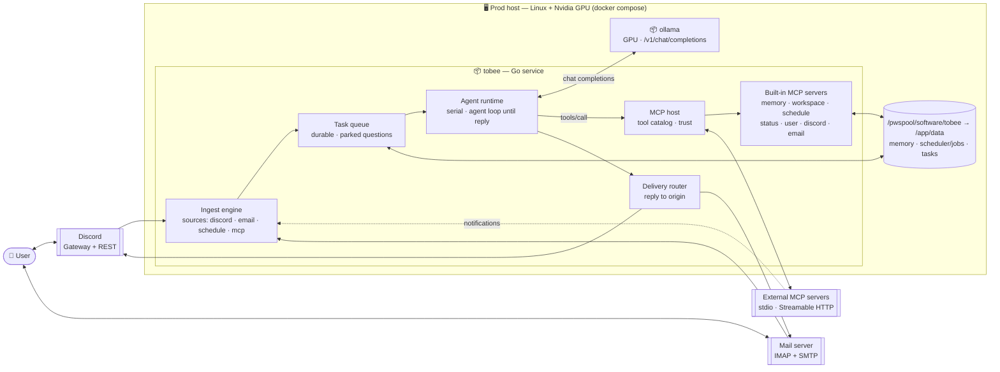

# tobee

A self-hosted personal AI agent (named after the family cat 🐾): it takes tasks from Discord, email, and its own timers, acts on them through MCP tools with a local tool-calling LLM, and keeps its memory in plain text files.

## Key Features

- **Pluggable inputs.** Discord, an IMAP inbox, scheduled jobs, and MCP resource notifications all feed one durable task queue. Sources restart on failure and can be registered at runtime.
- **MCP tool platform.** Built-in capabilities (memory, workspace, schedules, status, messaging) are MCP servers. Add third-party servers over stdio or HTTP with env vars alone. External servers are sandboxed by default.
- **One agent loop, on rails.** Each model call is schema-constrained JSON choosing one tool, so the model cannot ramble or write tool calls as text. It replies as soon as it can: a greeting is one call, and only multi-step work shows a live checklist. Tools are grouped by MCP annotations into read / write / external. Simple messages get a one-call answer. Every model output is a forced tool call.
- **Conversations that follow you.** Each person has one session across Discord, email, and other connectors. After 10 idle minutes it's saved to memory as a transcript.
- **Grounded replies.** Every change tobee makes is reported under the reply by code, deletions need your yes, and it can ask clarifying questions and resume on the answer.
- **Plain-text memory as MCP resources.** Per-user and shared folder trees under `data/memory/`, addressed as `memory://user/…` and `memory://shared/…` and read through one `resources_read` tool. No database, no vector store, no chat history.
- **Swappable model and reasoning.** The agent talks to an `llm.Model` interface; the OpenAI-compatible provider covers local and hosted backends by env. The reasoning strategy is an interface too.
- **Traceable reasoning.** Every log line is tagged `input`, `thinking`, `action`, `output`, `llm`, or `system`, and turn logs carry a task ID.

## System Design


```mermaid
flowchart LR
    user(["👤 User"])
    discordAPI[["Discord<br/>Gateway + REST"]]
    mail[["Mail server<br/>IMAP + SMTP"]]
    extMCP[["External MCP servers<br/>stdio · Streamable HTTP"]]

    subgraph host["🖥️ Prod host — Linux + Nvidia GPU (docker compose)"]
        subgraph tobee["📦 tobee — Go service"]
            direction TB
            ingest["Ingest engine<br/>sources: discord · email · schedule · mcp"]
            queue["Task queue<br/>durable · parked questions"]
            runtime["Agent runtime<br/>serial · agent loop until reply"]
            mcphost["MCP host<br/>tool catalog · trust"]
            builtin["Built-in MCP servers<br/>memory · workspace · schedule<br/>status · user · discord · email"]
            delivery["Delivery router<br/>reply to origin"]
        end
        ollama["📦 ollama<br/>GPU · /v1/chat/completions"]
        data[("/pwspool/software/tobee → /app/data<br/>memory · scheduler/jobs · tasks")]
    end

    user <--> discordAPI
    user <--> mail
    discordAPI --> ingest
    mail --> ingest
    extMCP -. notifications .-> ingest
    ingest --> queue --> runtime
    runtime <-->|chat completions| ollama
    runtime -->|tools/call| mcphost
    mcphost --> builtin
    mcphost <--> extMCP
    runtime --> delivery
    delivery --> discordAPI
    delivery --> mail
    builtin <--> data
    queue <--> data
```

- Every input becomes an event. The ingest engine dedups events, checks sender allowlists, and queues them. One worker runs one task at a time.
- The agent reaches every capability through the MCP host. The reply to the sender is sent by code; messages anywhere else are tool calls.
- Dev points at LM Studio on the host instead of the bundled Ollama container.

Architecture, the turn lifecycle, trust rules, and decisions are in [.claude/DESIGN.md](.claude/DESIGN.md).

## Local Dev Prerequisites

- **Go 1.25+** for native runs and tests.
- **Docker** with **Docker Compose v2**. The prod compose file uses `env_file` entries with `required:`.
- **An OpenAI-compatible LLM server that supports `response_format: json_schema`** (Ollama, LM Studio, vLLM, llama.cpp, OpenAI). Dev uses [LM Studio](https://lmstudio.ai/) on port 1234.
- **At least one connector:**
  - a Discord bot with the privileged **Message Content** intent enabled, and/or
  - a mailbox with IMAP and SMTP access (an app password).
- **Prod only:** Linux host with an Nvidia driver and [nvidia-container-toolkit](https://docs.nvidia.com/datacenter/cloud-native/container-toolkit/latest/install-guide.html).
- **Optional:** the runtime for any stdio MCP server you add (for example Node for `npx` servers). The prod image doesn't include one.

```bash
go mod download
```

## Configuration & Environment Variables

Read from `.env` (dev) or `.env.prod` (prod compose). `.env.example` has every variable with comments.

| Variable | Required | Default | Purpose |
|---|---|---|---|
| `AI_PROVIDER` | no | `openai` | LLM provider implementation. `openai` covers every OpenAI-compatible server. |
| `AI_PROVIDER_URL` | yes | — | OpenAI-compatible base URL; `/v1/chat/completions` is appended. |
| `AI_MODEL` | no | `local-model` | Model name. Must support tool calling (prod: `qwen2.5:7b`). |
| `AI_API_KEY` | no | — | Bearer token for hosted APIs. |
| `AI_TEMPERATURE` | no | `0.1` | Keep low; every call is a structured decision. |
| `AI_MAX_TOKENS` / `AI_TIMEOUT` | no | `2048` / `10m` | Per-completion token cap and HTTP timeout. |
| `AGENT_STRATEGY` | no | `react` | Reasoning strategy: the tool-calling agent loop. |
| `AGENT_TURN_BUDGET` | no | `2m` | Wall-clock cap per turn, and the only hard bound on one turn's work — tool calls are not counted. |
| `GREP_BIN` | no | `grep` (`/usr/bin/grep` in the image) | Binary behind `memory_grep` / `workspace_grep`, run inside the sandbox. Boot runs a real search with it and refuses to start if the results are wrong, so a variant that lacks `-I` (BusyBox) fails immediately instead of mid-turn. |
| `TZ` | no | UTC | IANA zone the instance thinks in — reminders, `<context>`, status reports, logs. A container has no zone, so leaving this unset means UTC. |
| `IDENTITY_<NAME>` | no | — | Links one person's accounts, e.g. `discord:2643…,email:me@example.com`, so sessions and memory follow them across connectors. |
| `AGENT_REFLECT` | no | `true` | When a conversation with failures ends, draw up to 3 lessons from it into `memory://user/.tobee/lessons.md`, which is pinned into every prompt. One extra model call per such conversation. |
| `SESSION_IDLE_TIMEOUT` | no | `10m` | Inactivity before a conversation is saved to memory and a new one starts. |
| `DISCORD_TOKEN` | one connector | — | Enables the Discord connector. |
| `DISCORD_CHANNEL_ID` | no | *(all)* | Only handle this guild channel and its threads. DMs are never scoped out. |
| `DISCORD_ALLOWED_USERS` | no | *(all)* | Comma-separated user IDs to accept. |
| `EMAIL_IMAP_ADDR` | one connector | — | Enables the email connector (`host:993` for TLS). |
| `EMAIL_SMTP_ADDR`, `EMAIL_USERNAME`, `EMAIL_PASSWORD`, `EMAIL_FROM` | with email | — | Mailbox credentials and sender address. |
| `EMAIL_ALLOWED` | with email | — | Comma-separated addresses tobee reads from and may send to. |
| `EMAIL_MAILBOX` / `EMAIL_POLL_INTERVAL` | no | `INBOX` / `1m` | Folder and poll rate. |
| `MCP_SERVER_<NAME>_COMMAND` or `_URL` | no | — | External MCP server over stdio or HTTP. Companions: `_BEARER_TOKEN`, `_ENV_<VAR>`, `_TRUSTED`, `_TIMEOUT`, `_SUBSCRIBE`, `_REPLY_TO`. |
| `WORKSPACE_AREA_<NAME>` | no | — | Host directory exposed as workspace area `<name>`. `_DESC` for a description, `_READONLY=true` to block writes. |
| `WORKSPACE_MAX_FILE_SIZE` | no | `262144` | Per-file byte cap for workspace areas. |
| `DATA_DIR` / `PROMPTS_DIR` | no | `data` / `prompts` | State and prompt roots. |
| `LOG_LEVEL` | no | `info` | `info` logs the reasoning chain; `debug` adds every prompt message and raw response. |
| `LOG_FORMAT` | no | `text` | `text` or `json`. |
| `LOG_CONTENT_LIMIT` | no | `4000` | Max bytes of content per log field; `0` = unlimited. |
| `OLLAMA_KEEP_ALIVE` | no | `5m` (Ollama) | Prod compose only. How long the model stays in VRAM. |

Prod secrets in Jenkins: `tobee-discord-token`, `tobee-log-level`, `discord-pws-builds-channel-webhook`.

## Operational Runbook

### Local setup & development

```bash
git clone git@github.com:runyanjake/tobee.git
cd tobee
cp .env.example .env                       # set DISCORD_TOKEN and/or EMAIL_*; start LM Studio with a tool-capable model
docker compose up --build                  # prompts and data are bind-mounted; restart to pick up prompt edits
# or run natively:
AI_PROVIDER_URL=http://localhost:1234 go run ./cmd/tobee
```

### Testing & linting

```bash
go test ./...
go test -race ./...
gofmt -l .                                 # must print nothing
go vet ./...
docker build --target lint .               # same lint stage Jenkins runs
```

### Production build & run

```bash
cp .env.prod.example .env.prod             # set DISCORD_TOKEN and a tool-capable AI_MODEL
sudo mkdir -p /pwspool/software/tobee && sudo chown "$(id -u):$(id -g)" /pwspool/software/tobee
docker compose -f docker-compose.prod.yml up -d --build   # waits for Ollama health and the model pull
```

Jenkins (`Jenkinsfile`) runs the same flow: lint → render `.env.prod` → GPU preflight → `down` → `up -d --build` → health check → boot-log smoke test → Discord notification.

### Common operations

```bash
# Tail logs (dev: docker compose logs -f tobee)
docker compose -f docker-compose.prod.yml logs -f tobee

# Confirm boot: both lines must appear
docker compose -f docker-compose.prod.yml logs tobee | grep -E "tobee is running|discord: connected"

# See which MCP servers connected and how many tools the model has
docker compose -f docker-compose.prod.yml logs tobee | grep -E "mcphost: (connected|catalog ready)"

# Follow one category of the reasoning chain (input | thinking | action | output | llm | system)
docker compose -f docker-compose.prod.yml logs -f tobee | grep "cat=thinking"

# Replay one turn end to end (task id from any of its lines)
docker compose -f docker-compose.prod.yml logs tobee | grep "task=t-1a2b3c4d"

# With LOG_FORMAT=json
docker compose -f docker-compose.prod.yml logs --no-log-prefix tobee | jq -c 'select(.cat=="action")'

# Find protocol violations and failing sources
docker compose -f docker-compose.prod.yml logs tobee | grep -E "PROTOCOL VIOLATION|ingest: source stopped"

# Inspect queued and parked tasks, memory, and scheduled jobs on the prod host
ls /pwspool/software/tobee/tasks/pending /pwspool/software/tobee/tasks/parked
ls -R /pwspool/software/tobee/memory
cat /pwspool/software/tobee/scheduler/jobs/*.json

# Check which models Ollama has pulled
docker compose -f docker-compose.prod.yml exec ollama ollama list

# Restart after prompt or config changes (prod prompts are baked in: rebuild)
docker compose -f docker-compose.prod.yml up -d --build tobee

# Stop (named volumes and data persist)
docker compose -f docker-compose.prod.yml down
```
